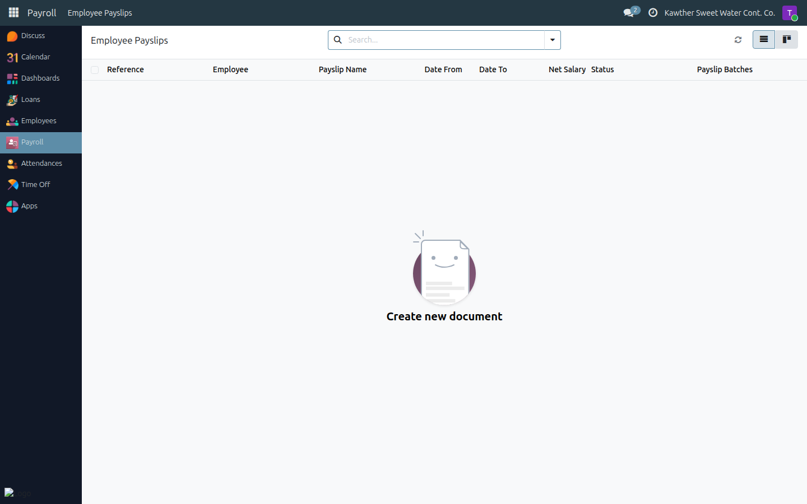
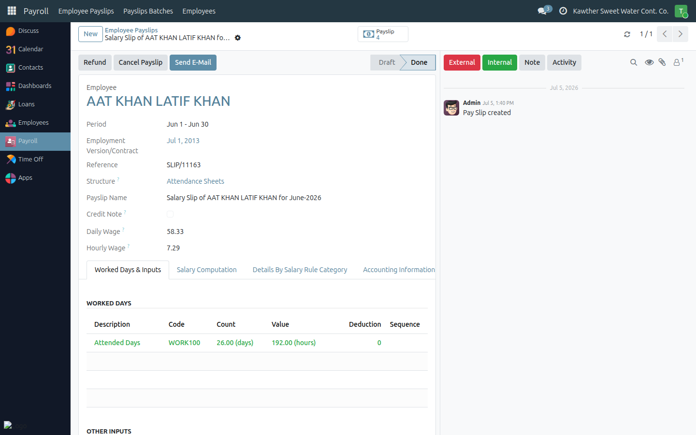

# Viewing My Payslip

**Who is this for:** Employee
**How long it takes:** 1 minute

## What this does

Lets you open and download your monthly payslip and see how your **net salary**
was calculated — your basic pay, additions, and any deductions such as loan
installments or attendance deductions.

## Before you start

- You can only see **your own** payslips.
- A payslip appears once HR/payroll has generated the month's payroll.

## Steps

1. **Open Payroll** from the main menu, then **My Payslips**.
   

2. **Open the month** you want. The **Net Salary** is shown on the list and at
   the bottom of the payslip.

3. **Read the salary lines**, top to bottom:
   - **Basic** — your base salary.
   - **Gross** — total of your additions.
   - **Attendance Deduction** — deducted for uncovered absence / lateness.
   - **Total Deductions** — the sum of your loan/penalty installments this month.
   - **Net Salary** — what is transferred to your bank.
   

4. **Download / print** using the print icon if you need a copy (e.g. for a bank
   or a visa).

## What happens next

This view is read-only. If a figure looks wrong:

- **Loan deduction questions** → see [Request a loan](03-request-a-loan.md); the
  Installments tab of your loan shows the full schedule.
- **Attendance deduction questions** → check [your attendance](01-view-attendance.md);
  an uncovered absence causes a deduction.
- **Anything else** → contact HR/payroll.

## Common issues

| Symptom | Cause | Fix |
|---|---|---|
| No payslip for this month | Payroll not generated yet | Wait for the payroll run, or ask HR |
| Net is lower than expected | A loan installment / attendance deduction applied | Open the payslip; the deduction lines explain the difference |

## Related guides

- [Request a loan](03-request-a-loan.md)
- [View my attendance](01-view-attendance.md)
