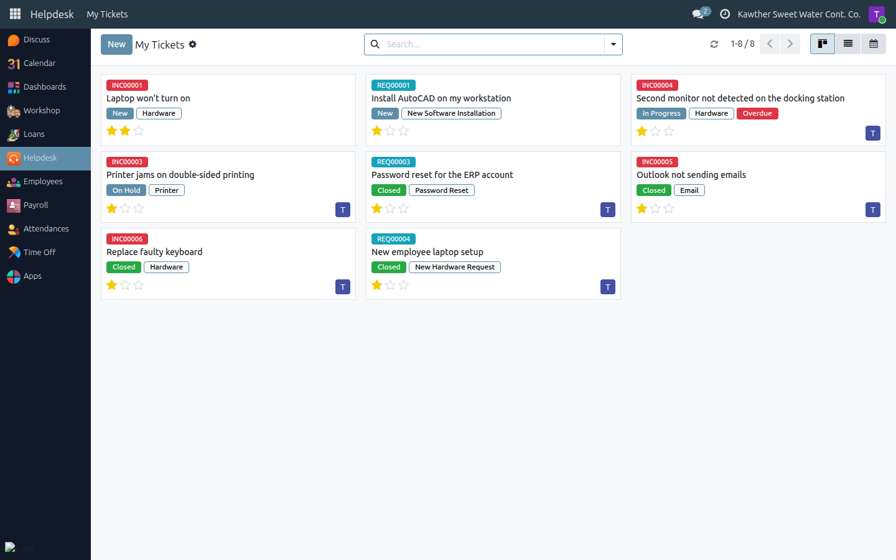
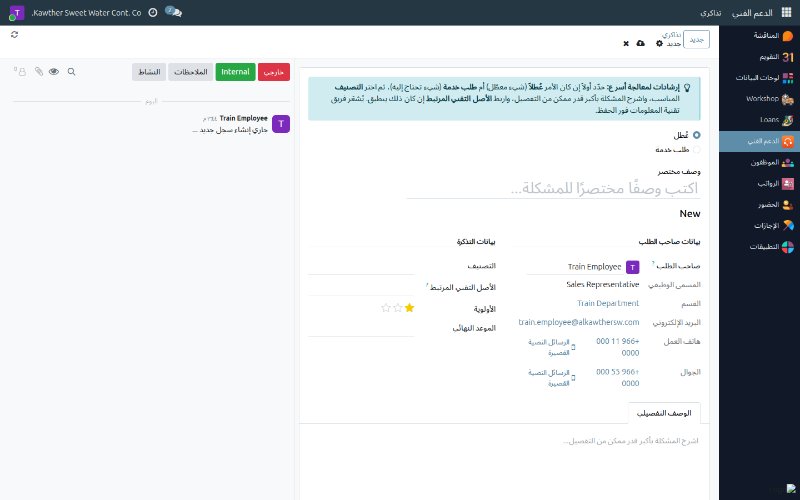
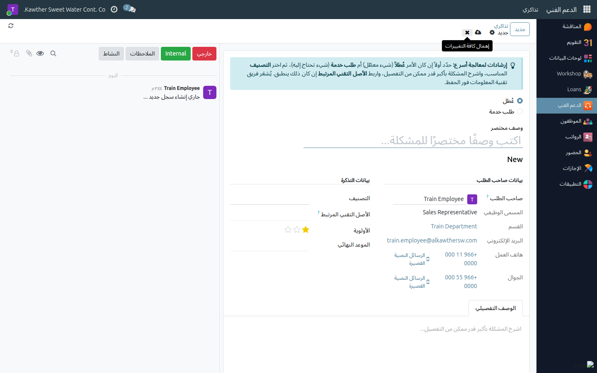
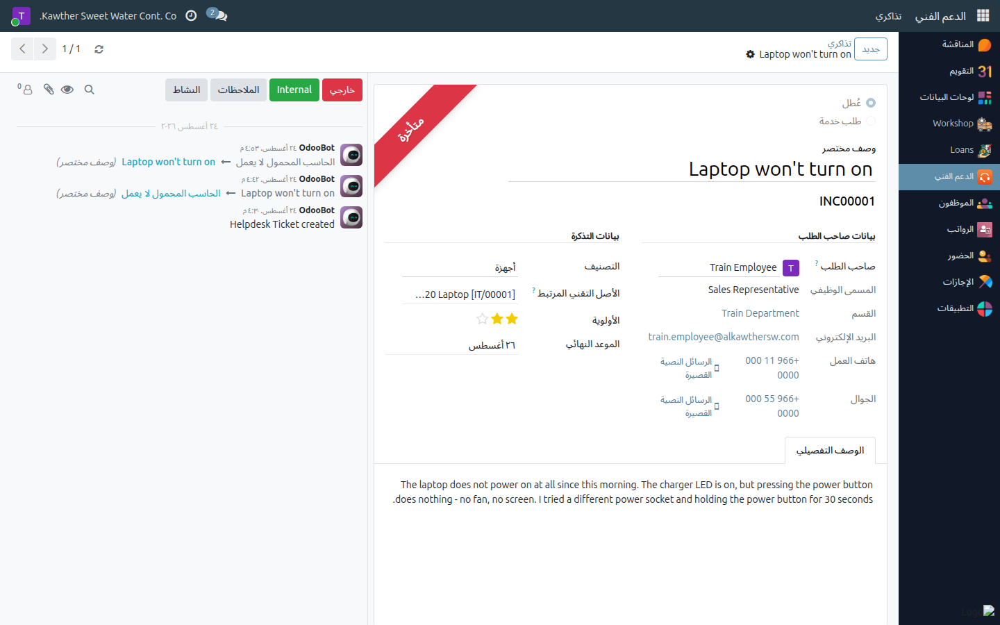

# Raising an IT Support Ticket

**Who is this for:** Employee (for yourself)
**How long it takes:** 2 minutes

## What this does

Reports an IT problem — or asks IT for something you need — as a tracked
ticket instead of a phone call or a message. The IT team is notified the
moment you save, and you can follow the ticket to resolution from the same
screen.

Every ticket is one of two kinds, and you choose which:

| Kind | Use it when | Ticket number |
|---|---|---|
| **Incident** | Something is broken or not behaving as it should — laptop won't start, no internet, printer jams, email not sending | `INC00001` |
| **Service Request** | Nothing is broken; you need something — new software, a new device, access to a folder, a password reset, or just information | `REQ00001` |

The kind you pick decides which **Categories** are offered, and it is **fixed
once the ticket is created** — it sets the ticket number. If you get it wrong,
close the ticket and raise a new one of the right kind.

## Before you start

- You can raise a ticket **for yourself**. (If you manage people, you may also
  raise one for a direct report — see
  [Raising a ticket for a team member](../supervisor/09-ticket-for-team-member.md).)
- Have the details ready: what exactly happens, when it started, any error
  message, and which device it concerns.

## Steps

1. **Open the Helpdesk app**, then **My Tickets**. This list shows every ticket
   you have raised, open and closed.
   

2. **Click New.**

3. **Choose the kind** at the top of the form — **Incident** or **Service
   Request**.
   

4. **Write a short description** in the title line — one clear sentence, e.g.
   *"Laptop won't turn on"*, not *"urgent problem"*.

5. **Pick the Category** that fits (Hardware, Software, Network & Internet,
   Email, Printer, Access & Permissions, Other — and for service requests, New
   Hardware Request, New Software Installation, Access / Permission Request,
   Password Reset, Information / How-To). Only categories belonging to the kind
   you chose are offered.

6. **Link the Related Asset** if the ticket is about a specific device. The list
   only offers equipment currently registered to you — your laptop, your phone,
   your monitor. Leave it empty if it doesn't apply.

7. **Set the Priority** honestly (Low / Medium / High / Urgent). Medium is the
   default and is right for most tickets.

8. **Fill in the Detailed Description** tab — this is required, and it is what
   gets the fix moving. Include what you were doing, the exact error text, and
   whether it happens every time.
   

9. **Save.** The ticket gets its number (`INC…` / `REQ…`) and enters the **New**
   stage.
   

## What happens next

- Your ticket lands in the IT team's queue in the **New** stage. When an agent
  takes it, it moves to **In Progress** and their name appears in **Assigned
  To**.
- **Talk to IT on the ticket itself.** In the message box at the bottom (the
  chatter), click **External**, type, and send — everyone following the ticket
  is notified. Attach a photo or a screenshot of the error the same way. This
  keeps the whole history in one place instead of scattered across calls.
- If IT needs something from you and can't proceed, they set the ticket to
  **Blocked** — you'll see a red marker on it.
- When the work is done, IT closes the ticket. It moves to **Closed**, the
  closing date and who closed it are recorded, and a **Resolution Feedback**
  box appears on the ticket: rate it **Great**, **Okay** or **Not Good**.
  Please answer — it is the only feedback the IT team gets.

> **What you can and cannot change.** You own the content of your ticket —
> title, description, category, asset, priority, deadline. The **stage**, the
> **assignee** and the **blocked/ready marker** belong to the IT team; you can
> see them but not set them.

## Common issues

| Symptom | Cause | Fix |
|---|---|---|
| The Category list is empty or missing the one I want | Categories are split by kind | Check the **Incident / Service Request** choice at the top — the list changes with it |
| I can't change Incident to Service Request | The kind is fixed after creation (it sets the ticket number) | Close this ticket and raise a new one of the right kind |
| **Related Asset** doesn't offer my laptop | The asset isn't registered to you in the system | Raise the ticket without it and say which device it is in the description; IT will correct the register |
| I can't change the stage or assign the ticket | Those belong to the IT team | Ask in the ticket's message box — IT is notified |
| "You can only create or edit tickets for yourself or your direct reports" | **Reported By** points at someone who is not you or a direct report | Set **Reported By** back to yourself |
| I don't see a ticket a colleague raised | You only ever see your own tickets (and your direct reports') | That is by design |

## Related guides

- [Raising a ticket for a team member](../supervisor/09-ticket-for-team-member.md) — managers
- [Getting Started](../00-getting-started.md) — login, navigation, notifications
