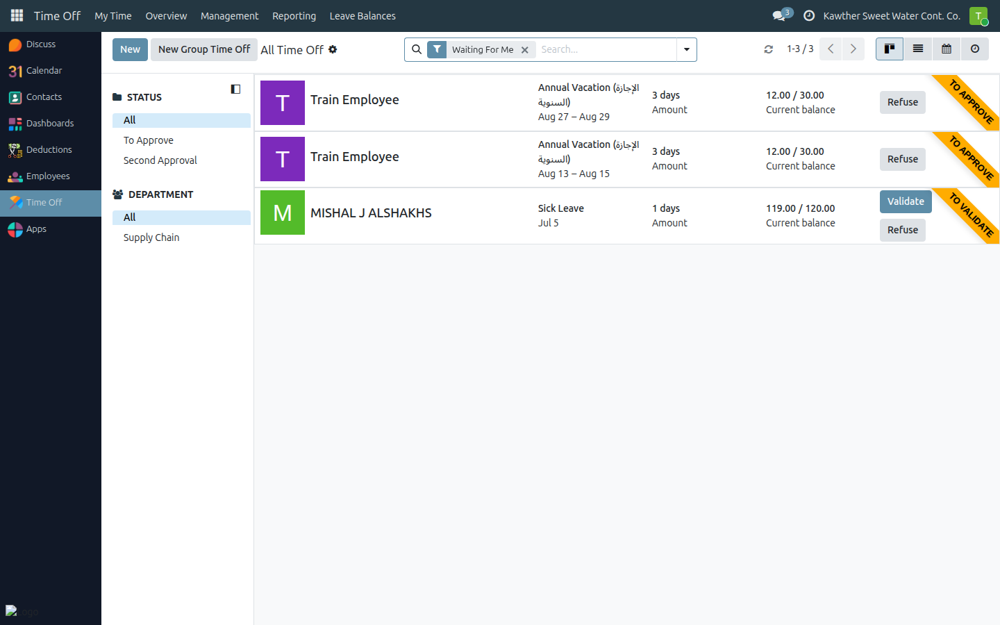
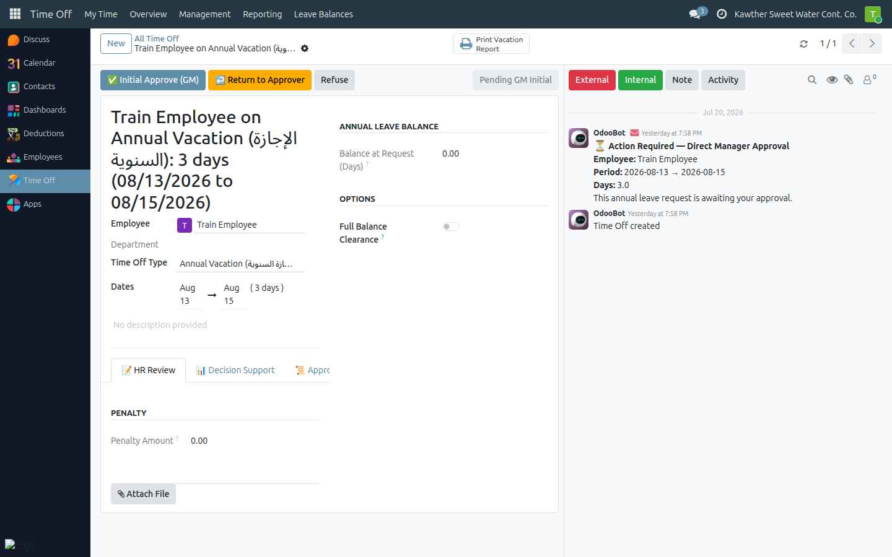

# Leave: GM Approvals

**Who is this for:** General Manager
**How long it takes:** 1–2 minutes per request

## What this does

Covers your **two** approval points on an annual leave:
1. **Initial approval** (step 3) — a review after HR.
2. **Final approval** (step 5) — after Accounting; this creates the vacation
   payslip and sends the leave on for the signed-form confirmation.

## Before you start

- Leave requests live in **Time Off → Management → Time Off**. Look for requests
  at **Pending GM Initial** or **Pending GM Final**.

## Steps — Initial approval

1. **Open Time Off → Management → Time Off** and open the employee's request
   (at **Pending GM Initial**).
   

2. **Open the leave** and review the HR/Decision-Support details (read-only at
   this step).

3. Click **Initial Approve (GM)** → the leave moves to **Accounting**.
   (Or use **Return to Approver** — see the next guide.)
   

## Steps — Final approval

1. Open the leave (now at **Pending GM Final**) and review the **Accounting**
   tab figures.

2. Click **Final Approve (GM)**.
   

   This **creates the vacation payslip** and moves the leave to **Pending HR
   Confirmation** (HR then attaches the signed form).

## What happens next

- Initial approval → Accounting fills the financial details.
- Final approval → vacation payslip is generated; HR does the final confirmation.

## Common issues

| Symptom | Cause | Fix |
|---|---|---|
| No approve button | Leave not at a GM step | Check the status bar |
| I don't want to refuse but it needs changes | Use **Return to Approver** | See [Return to approver](02-return-to-approver.md) |

## Related guides

- [Return to approver](02-return-to-approver.md)
- [Loan: GM final approval](03-loan-gm-approval.md)
