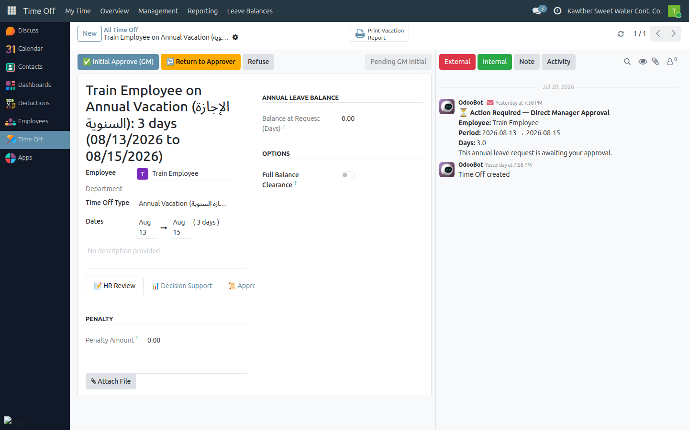
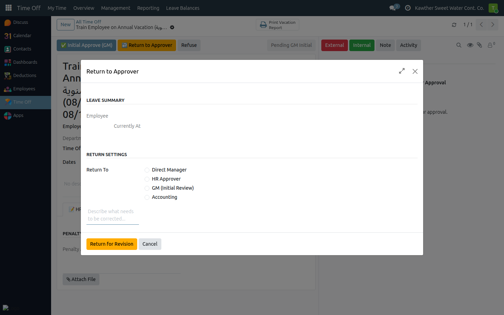

# Return a Leave to an Earlier Approver

**Who is this for:** General Manager
**How long it takes:** 1 minute

## What this does

Instead of refusing a leave outright, lets you send it **back** to an earlier
approver (for example HR or the direct manager) with a note explaining what
needs to change. The request keeps its history and simply resumes from the step
you choose.

## Before you start

- This is available only to the GM, and only at the two GM steps (**Pending GM
  Initial** and **Pending GM Final**).
- From the initial step you can return to the DM or HR. From the final step you
  can return to the DM, HR, GM-initial, or Accounting.

## Steps

1. Open the leave at a GM step and click **Return to Approver**.
   

2. In the window, choose the **target step** to return to and type a **reason**
   (this is sent to that approver).
   

3. Click **Return for Revision**.

## What happens next

The leave goes back to the chosen step. That approver receives an **Inbox
notification** with your reason and re-does their part. Stamps from the returned
step onward are cleared; earlier approvals are kept. When it comes back up the
chain, it returns to you.

## Common issues

| Symptom | Cause | Fix |
|---|---|---|
| No **Return to Approver** button | You're not the GM, or not at a GM step | It's GM-only and appears only at the GM steps |
| A step isn't offered as a target | It's not a valid return target from your current step | Choose one of the allowed earlier steps |

## Related guides

- [Leave: GM approvals](01-leave-gm-approvals.md)
