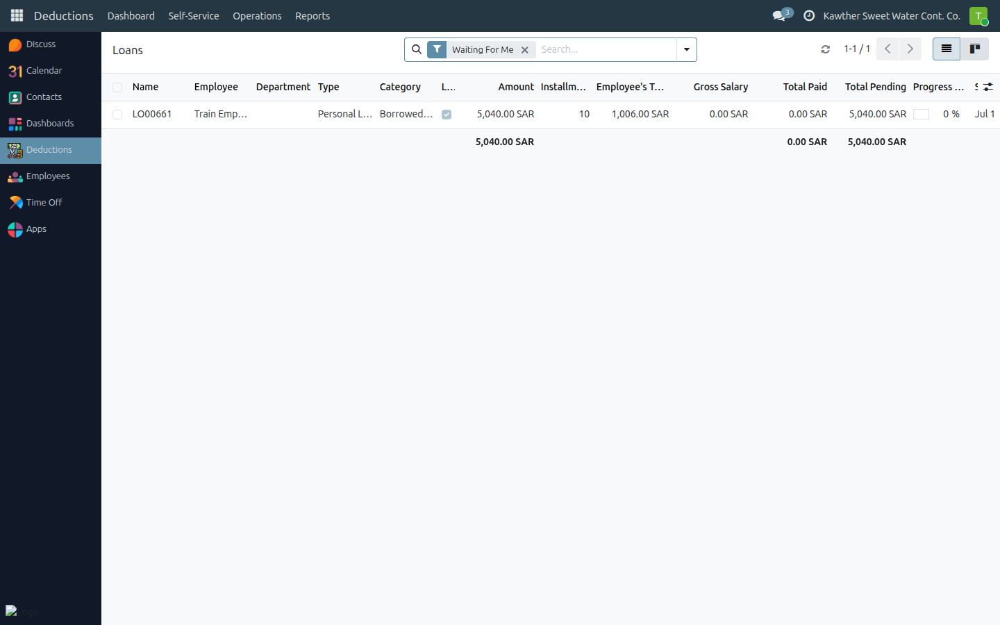
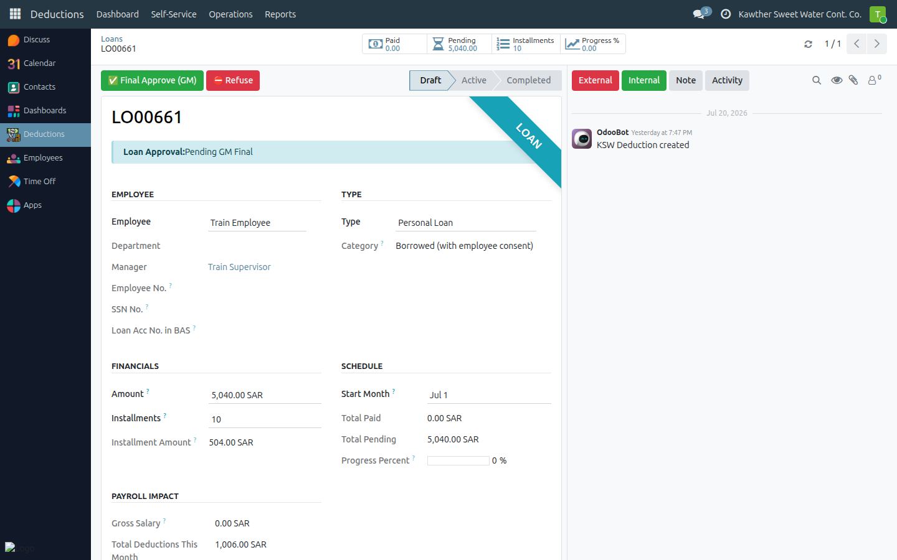

# Loan: GM Final Approval

**Who is this for:** General Manager
**How long it takes:** 1 minute per loan

## What this does

Lets you give the **final approval** on a loan, after HR and Accounting. Your
approval sends the loan to disbursement.

## Before you start

- Loans live in **Loans → Operations → Loans** (opens on **Waiting For Me**).

## Steps

1. **Open the Loans app → Operations → Loans.** It opens on **Waiting For Me**,
   showing loans at **Pending GM Final**.
   

2. **Open the loan** and review the amount, installments, and the Decision
   Support summary (leave balance, other deductions, gross salary impact).

3. Click **Final Approve (GM)** → the loan moves to **Pending Disbursement**.
   (Or **Refuse** with a reason.)
   

## What happens next

Accounting confirms disbursement, which turns the loan **Active** and starts its
installments.

## Common issues

| Symptom | Cause | Fix |
|---|---|---|
| No final-approve button | Loan not at the GM step | Check the approval-state banner |

## Related guides

- Accounting: [Loan approval & disbursement](../accounting/02-loan-approval-disbursement.md)
