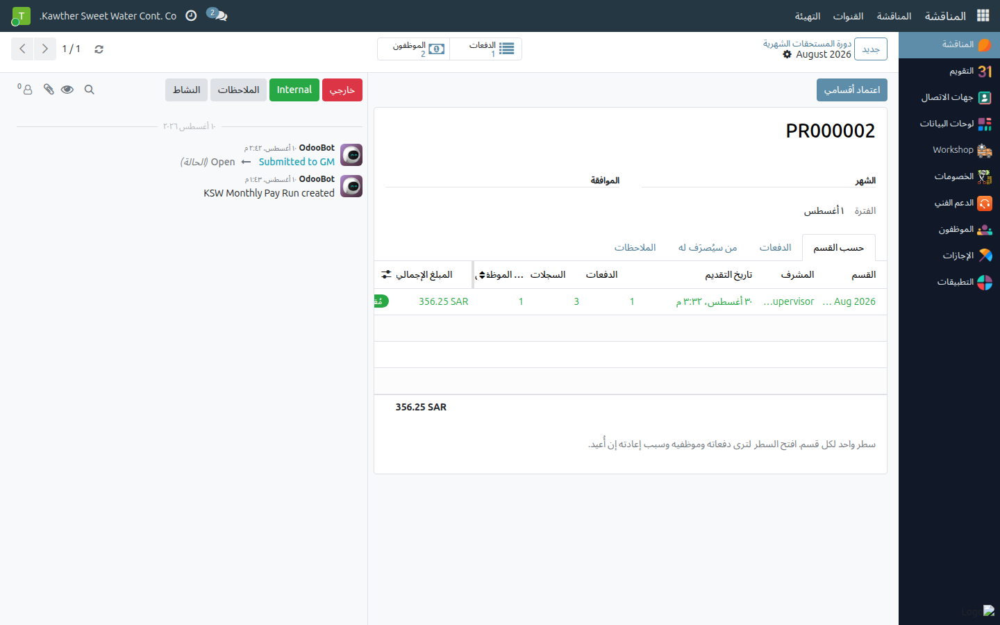

# Approving the Month's Commissions & Allowances

**Who is this for:** General Manager (department GM), and the company's General Manager for the last two sections
**How long it takes:** 10–15 minutes a month

## What this does

Each month your supervisors record what their teams earned on top of salary —
overtime, driver trips, meals, allowances, bonuses — and hand their department over
to you. You review it, then approve or send it back. Your approval is what turns the
figures into money: it settles the employees' parked loan installments and locks the
month for payment.

> **Sales & Collection is not part of this.** It is calculated on its own page and
> paid separately; it never reaches your approval here.

## Before you start

- You approve **only the departments you are set as General Manager of**. A
  department whose GM is somebody else stays with them, however senior you are.
- A department reaches you only when its supervisor presses **Submit My Entries**.
  A batch marked *Submitted* is not yet handed over.

## Steps

1. **Open Commissions → Monthly Pay Run** and pick the month. The **By Department**
   tab is one row per department: the supervisor's name, how many records, how many
   employees, the total, the status and when it arrived.
   

   You are also told, in a blue banner, which departments have **not** handed over yet.

2. **Review before you approve.**
   - **Who Gets Paid** lists every employee due to be paid: earnings, the loan
     recovery about to be taken, and the net.
   - Open any department row → **Employees** to see the entries behind its total.
   - On any entry, the **calculator** icon shows exactly how the amount was reached —
     the salary, divisor and overtime factor, or every trip tier with its rate.
   

3. **Approve.** Either **Approve** on a single department's submission, or
   **Approve My Departments** on the pay run to clear all of yours at once.
   

4. **Or send it back.** On the department's submission, type the **Return Reason**,
   then click **Return for Correction**. The reason is required — the supervisor
   needs to know what to fix.
   

## What happens next

- **Returned:** the department goes back to the supervisor, the reason is written
  onto every batch in it, and he is notified in his inbox.
- **Approved, with other departments still waiting:** your departments are locked
  and the month stays open for the others.
- **Approved, and nothing is left waiting:** the month finalises itself. The
  **Payment Register** is built from the approved departments only, the parked loan
  installments are settled out of the commission, and the period **locks** — no
  supervisor can add or change anything in it. Accounting then exports the bank file.

## Closing a month that is still incomplete — the company's General Manager only

If a department never hands over, someone still has to decide the month is finished.
That is a company-level call and it belongs to the **company's General Manager**, not
to a department GM:

- **Lock the Month Now** — pays only what was approved. A department that never
  submitted keeps its work in Draft for next month.
- **Reopen** — unlocks an approved month, returns the settled loan installments to
  pending and turns the register back into a preview. It unwinds **every**
  department's settlement at once, which is why no single department GM can do it.

If you need either and the button is not there, ask the company's General Manager.

## Common issues

| Symptom | Cause | Fix |
|---|---|---|
| No **Approve** button on a department | It is not yours — its GM is someone else | The message names who it is waiting on |
| "None of the departments waiting … are yours to approve" | Same as above, from the pay-run button | Approve from your own departments, or ask the named GM |
| "No General Manager is set for …" | The department has no GM and the company has no default | Ask HR to set the department's General Manager |
| **Return for Correction** refuses | The Return Reason is empty | Type the reason in the field above the button first |
| A department is missing from the month | It has not handed over | The blue banner lists them; chase the supervisor |
| The register looks wrong after approval | Only **approved** departments are included | Check the chatter message — it lists what was left out and why |

## Related guides

- Supervisor: [The monthly cycle](../supervisor/06-commission-monthly-cycle.md)
- Accounting: [Commissions: bank export](../accounting/04-commission-export.md)
- [Returning a request to an earlier approver](02-return-to-approver.md)
