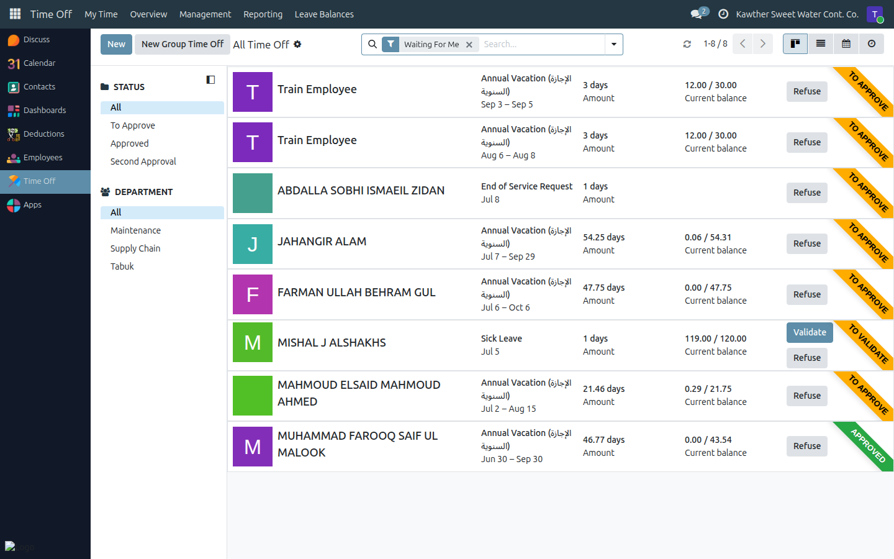
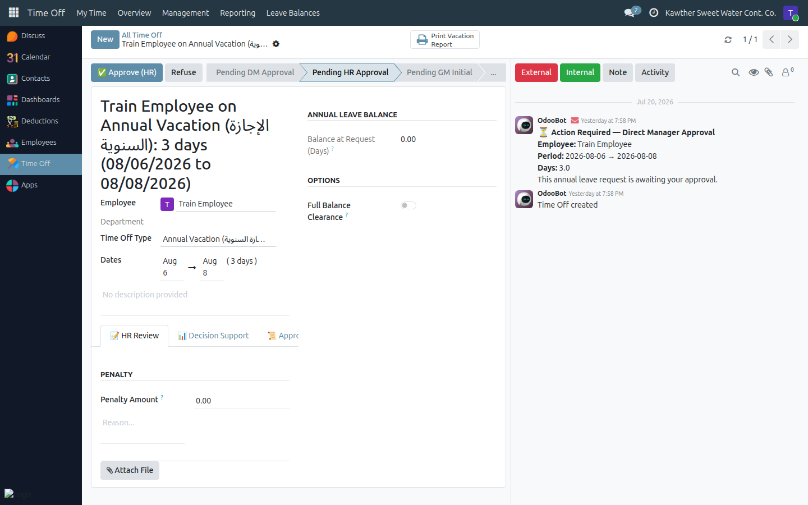

# Leave: HR Approval

**Who is this for:** HR
**How long it takes:** 1–2 minutes per request

## What this does

Covers your **two** roles in the leave workflow:
1. The **HR approval** step (step 2 of annual leave; the final step of sick /
   unpaid / other leaves).
2. The **HR confirmation** of the signed form at the end of annual leave
   (step 6).

## Where to find requests

Open the **Time Off** app, then **Management → Time Off**. This list shows the
company's leave requests; find the employee whose request is waiting for you
(for annual leave, look for their **Annual Vacation** request).

## Steps — HR approval

1. **Open the employee's request** from **Management → Time Off**.

2. **Fill in the HR details.** For annual leave, complete the **HR Review** tab
   as applicable — for example a **penalty amount** and its reason, or any
   required notes for the request.
   

3. **Approve:**
   - **Annual leave** → click **Approve (HR)**. It moves to the GM for initial
     review.
   - **Sick / unpaid / other** → click **Validate**. This is the final approval
     and the leave is granted.

   To decline instead, use **Refuse** with a reason.

## Steps — HR confirmation (annual leave, final step)

After the GM's final approval, an annual leave returns to you at **Pending HR
Confirmation**, waiting for the signed leave form.

1. Open the leave (it's at **Pending HR Confirmation**) from **Management →
   Time Off**.
2. Click **Confirm & Finalise**.
3. **Upload the signed form** (PDF) in the window, then confirm.
   

The leave is now fully **Approved** and the employee's balance is deducted.

## What happens next

- Approving annual leave sends it to **GM (initial)** → Accounting → GM (final)
  → back to **you** for the signed-form confirmation.
- Validating a sick / unpaid / other leave grants it immediately.

## Common issues

| Symptom | Cause | Fix |
|---|---|---|
| I can't find a request | Wrong list | Use **Time Off → Management → Time Off**, not "My Time Off" |
| No **Confirm & Finalise** button | Leave not yet at the confirmation step | It appears only after GM final approval |
| Can't finalise | No signed form attached | Upload the PDF in the wizard first |
| I can't approve | You're not in the HR approver group | Ask an administrator to check your access |

## Related guides

- [Loan: HR approval](02-loan-hr-approval.md)
