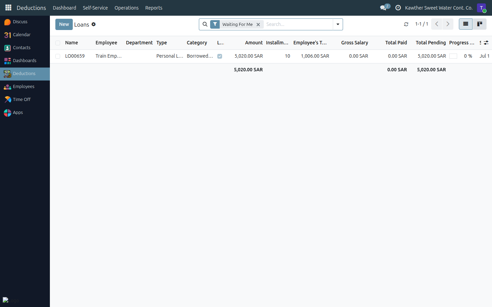
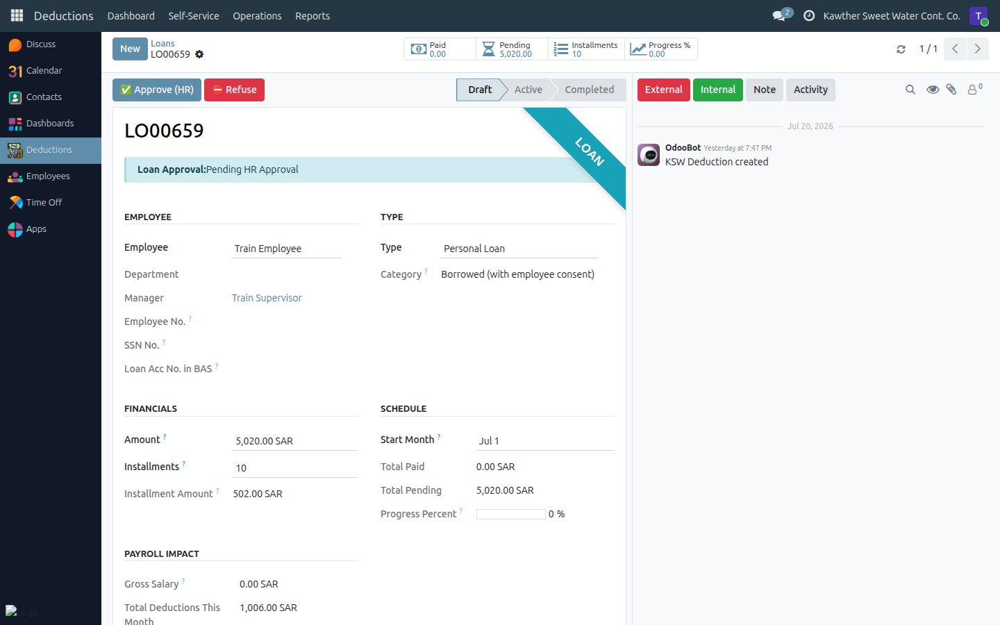

# Loan: HR Approval

**Who is this for:** HR
**How long it takes:** 1–2 minutes per request

## What this does

Lets you approve or refuse a loan at the **HR step** — the second step, after
the direct manager and before Accounting.

## Before you start

- Loans live in the **Loans** app under **Operations → Loans**; that list opens
  on **Waiting For Me**, showing loans at **Pending HR Approval**.

## Steps

1. **Open the Loans app → Operations → Loans.** It opens on **Waiting For Me**.
   

2. **Open the loan** and review the **Decision Support** tab, which summarises
   the employee's situation (leave balance, other active deductions, monthly
   impact) to inform your decision. You can also tick the HR confirmation
   ("no pending penalties") if applicable.

3. **Decide:**
   - **Approve (HR)** → moves the loan to **Pending Accounting**.
     
   - **Refuse** → enter a reason; the employee is notified.

## What happens next

An approved loan continues to **Accounting → GM (final) → Disbursement →
Active**. A refused loan returns to the employee with your reason.

## Common issues

| Symptom | Cause | Fix |
|---|---|---|
| No approve button | Loan isn't at the HR step | Check the approval-state banner |
| I want more context | Use the Decision Support tab | It shows balances and other deductions |

## Related guides

- [Create a deduction](03-create-deductions.md)
- [Leave: HR approval](01-leave-hr-approval.md)
