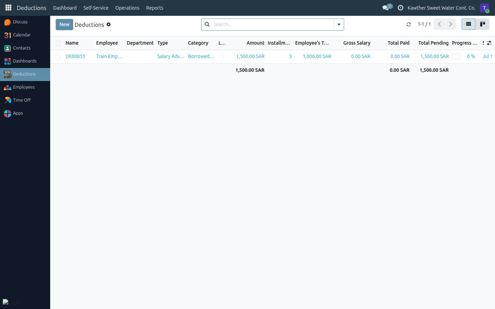
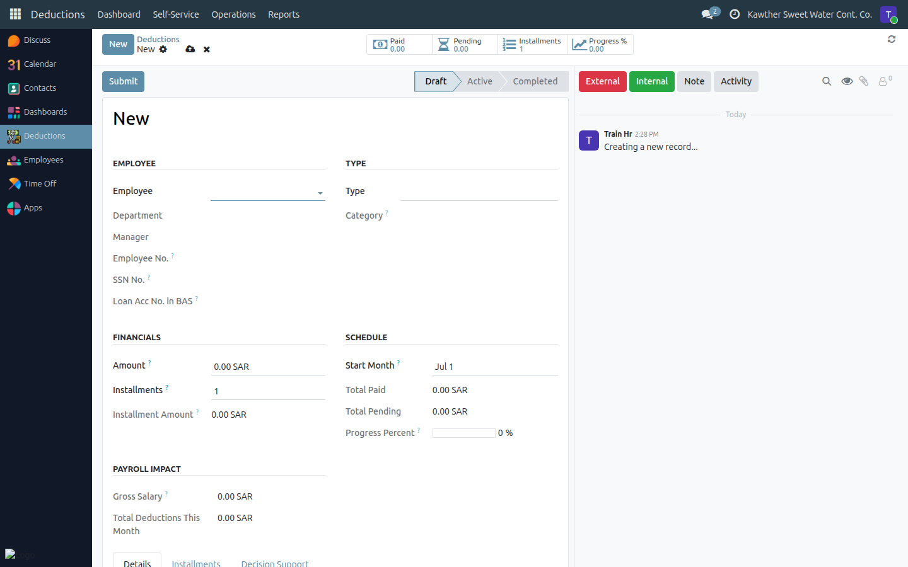

# Creating a Salary Advance

**Who is this for:** HR
**How long it takes:** 2 minutes

## What this does

Lets you create a **salary advance** — money paid to an employee ahead of
payroll and recovered from their salary over one or more installments. Advances
do **not** go through the four-step loan approval chain; you create one and it
takes effect on the next payslip.

> **Who creates what:** HR creates **salary advances**. **Government** and
> **internal penalties** are created by **Accounting** — see
> [Accounting → Create a penalty](../accounting/05-create-penalties.md). Loans
> are a separate flow with full approval — see the loan guides.

## Before you start

- Know the **employee**, the **amount**, and the number of **installments**
  (advances are often a single installment).

## Steps

1. **Open Deductions → Operations → Deductions** (the HR-managed list).
   

2. **Create a new record.** Choose the **employee** and the type **Salary
   Advance**.

3. **Enter the amount and installments.** The monthly installment schedule is
   generated for you.
   

4. **Submit.** The advance becomes active and will be deducted on the
   employee's next payslip(s).

## What happens next

The advance is **Active**. Each pending installment is picked up automatically
by payroll and shown on the employee's payslip under **Total Deductions**. When
all installments are paid, it is marked **Completed**.

## Common issues

| Symptom | Cause | Fix |
|---|---|---|
| I need to add a penalty | Penalties are Accounting's job | See [Accounting → Create a penalty](../accounting/05-create-penalties.md) |
| The amount isn't deducting | Still in Draft | Make sure you clicked **Submit** so it's Active |

## Related guides

- [Modify a deduction & change installments](04-modify-deductions.md)
