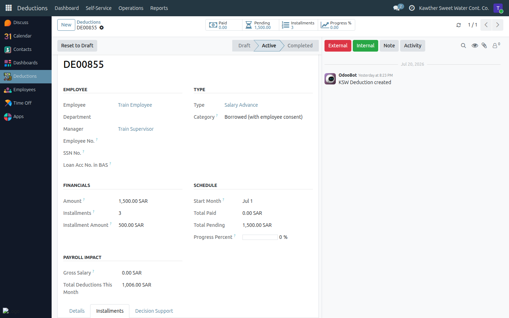
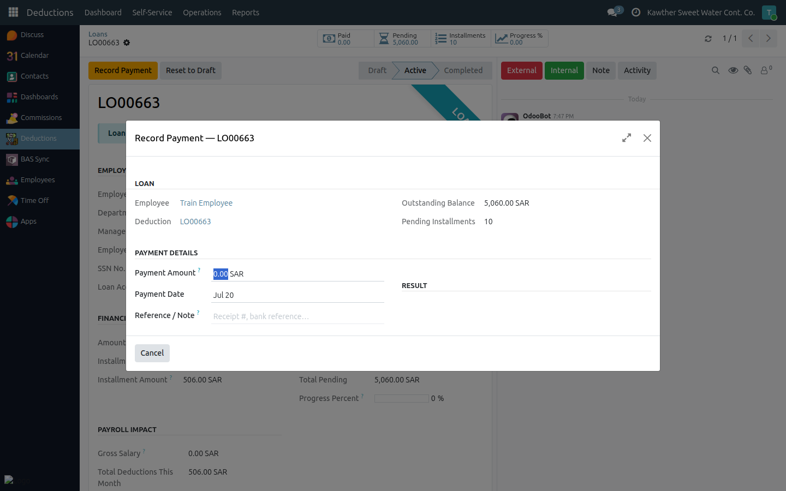

# Modifying Deductions & Changing Installments

**Who is this for:** HR
**How long it takes:** 1–3 minutes

## What this does

HR owns **installment changes** across loans and deductions: editing a schedule,
marking an installment paid outside payroll, recording a loan repayment, and
cancelling a deduction. Use this when an employee pays in cash, settles early, or
a schedule needs adjusting.

## Before you start

- You can freely edit amount and installments while a deduction is still in
  **Draft**. Once **Active**, the amount is fixed but you can still change
  pending installments, mark them paid, and record payments.
- Loans must be **Active** (disbursed) before their installments can be changed.

## Edit before it's active

1. Open the deduction (in **Draft**).
2. Change the **amount** or **installments**, then Save — the schedule updates.

## Mark a single installment paid

1. Open the record → **Installments** tab.
2. On a pending installment, add a short **note** (e.g. receipt number) and click
   **Mark Paid**.
   
3. The line turns green (Paid). If every installment is now paid, the record
   auto-completes.

## Record a loan payment (full or partial)

When an employee repays a loan outside payroll:

1. Open the active loan (**Loans → Operations → Loans**) and click
   **Record Payment**.
2. Enter the **Payment Amount**, **Payment Date**, and an optional note. The
   window shows what will happen:
   - **Full payment** (equals the outstanding balance) → **all** pending
     installments are marked paid.
   - **Partial payment** → the remaining balance is spread across the pending
     installments, and one new "paid" line records this payment.
   
3. Click **Confirm Payment**.

## Change the installment schedule

1. Open the record → **Installments** tab (editable view).
2. Adjust the **year/month** or **amount** of pending lines, or add a manual
   line. Paid lines are locked.

## Cancel a deduction

1. Open the record and click **Cancel** (confirm when prompted). Cancellation is
   limited once some installments are already paid.

## What happens next

Paid installments are excluded from future payroll runs. When every installment
is paid, the record auto-completes. The employee sees the updated Total Paid /
Total Pending.

## Common issues

| Symptom | Cause | Fix |
|---|---|---|
| I can't edit the amount | It's Active | Amount is fixed once active; cancel and recreate if it's wrong |
| No **Record Payment** button | Loan not active, or no pending installments | It must be **Active** with pending installments |
| Can't edit a paid line | Paid lines are locked | Only pending lines are editable |

## Related guides

- [Create a salary advance](03-create-deductions.md)
- [Loan: HR approval](02-loan-hr-approval.md)
