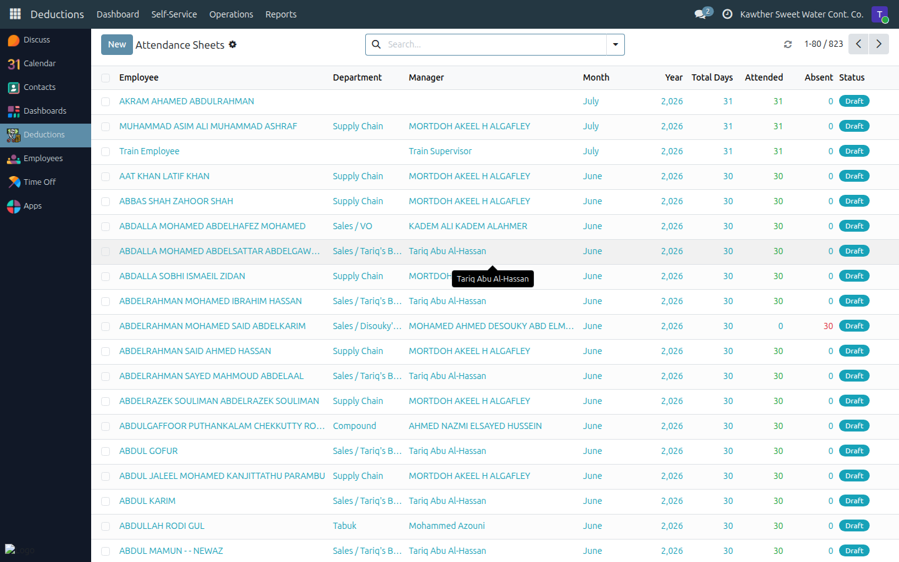

# Attendance Sheets (HR Review)

**Who is this for:** HR
**How long it takes:** 1–2 minutes

## What this does

Lets HR **review** the monthly attendance sheets of non-biometric staff across
the company. Day-to-day marking is done by each employee's **supervisor** — as
HR you look, but you don't normally change.

## Before you start

- You can **see every** sheet, but you **edit only** sheets for employees you
  **directly manage** (i.e. where you are their supervisor). For everyone else,
  the sheet is read-only for you.
- Approved-leave days are locked and are managed by the leave workflow, not by
  editing the sheet.

## Steps — review a sheet

1. **Open Attendance → Attendance Sheets.** You can see all sheets.
   

2. **Open a sheet** and review the daily attendance, the totals, and any
   absences. Green = attended, red = absent.

## If a correction is needed

- If you are the employee's **direct manager**, you can edit the sheet (mark days
  present/absent) the same way a supervisor does — see
  [Supervisor → Attendance sheets](../supervisor/03-attendance-sheets.md).
- If you are **not** their manager, ask the responsible **supervisor** to make
  the correction. HR review is for oversight, not day-to-day editing.

## Common issues

| Symptom | Cause | Fix |
|---|---|---|
| I can't edit a sheet | You're not that employee's manager | Ask their supervisor to correct it |
| A day looks wrong but is locked | It's covered by an approved leave | That's managed by the leave workflow, not the sheet |

## Related guides

- Supervisor: [Attendance sheets](../supervisor/03-attendance-sheets.md)
