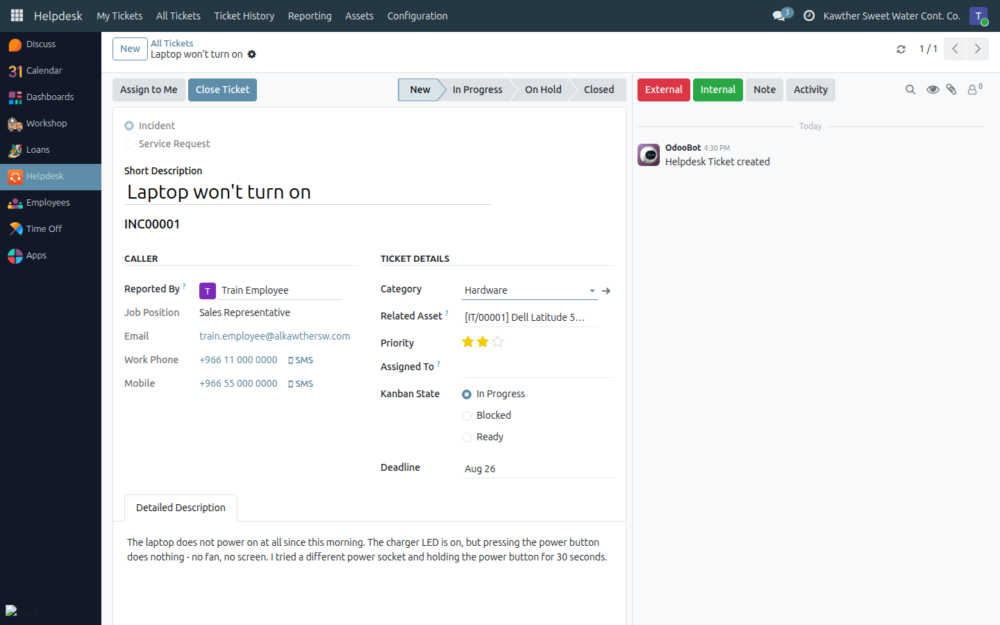
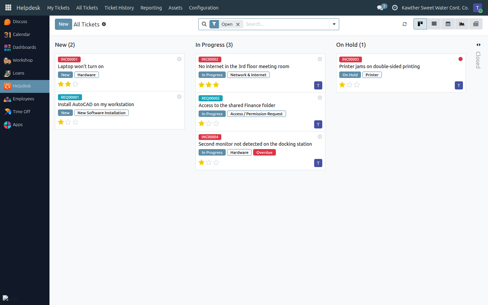

# Working the Ticket Queue

**Who is this for:** IT Team
**How long it takes:** a few minutes per triage round

## What this does

The queue is the IT team's single inbox. Everything employees report — from
every department — lands here in the **New** stage, and triage is the act of
turning that pile into work: what is it, how urgent is it, who owns it, and
when is it due.

## Before you start

- You need the **IT Team** role. It is the only helpdesk role besides the
  ordinary employee one, and it gives you everything: every ticket, the asset
  register, and the configuration menus.
- Employees see only their own tickets (and their direct reports'). You see all
  of them.

## The board

Open **Helpdesk → All Tickets**. It opens as a kanban board, grouped by stage,
already filtered to **Open** tickets.

The four stages are:

| Stage | Meaning |
|---|---|
| **New** | Nobody has picked it up yet |
| **In Progress** | Being worked on |
| **On Hold** | Parked — waiting for a part, a vendor, a budget approval |
| **Closed** | Resolved. Folds away on the board |

Each card carries everything you need to triage at a glance: the ticket number
badged **red for an Incident** and **blue for a Service Request**, the short
description, the stage and category, an **Overdue** badge if the deadline has
passed, the priority stars, and the assignee's avatar.

**Drag a card to another stage** to move it — as IT Team you can; employees see
the same board read-only.

## Steps — triaging a new ticket

1. **Open the ticket** from the **New** column.
   

2. **Read the Caller panel** on the left — job title, department, email, work
   phone and mobile, pulled live from the employee record. That is who you call.

3. **Check the kind and category.** Employees often file a service request as an
   incident. The category you can correct; the **kind is fixed** (it set the
   ticket number), so if it is badly wrong, close it with a note and ask for a
   new one.

4. **Set the Priority.** Stars on the form, or straight from the card.

   | Priority | Use it for |
   |---|---|
   | **Urgent** | Work is stopped for a person or a team right now |
   | **High** | Significant impact, a workaround exists |
   | **Medium** | Normal — the default |
   | **Low** | Nice to have, no impact |

5. **Take it — or give it.** Click **Assign to Me** in the header, or set
   **Assigned To** to another team member. Only IT Team members can be assigned;
   the field will not accept anyone else. The moment someone is assigned, they
   start following the ticket and are notified of every message on it.

6. **Set a Deadline** if the ticket has one. Once that date passes and the ticket
   is still open, it turns red in the list, gets an **Overdue** badge on the
   card and an **Overdue** ribbon on the form, and can be pulled up with the
   **Overdue** filter. Deadlines also show on the **Calendar** view of the
   queue.

7. **Move it to In Progress** — click the stage in the status bar at the top of
   the form, or drag the card.

## Finding things fast

The search panel gives you the filters triage actually needs:

- **Assigned to Me** — your own workload
- **Unassigned** — the triage pile: what nobody owns yet
- **Incidents** / **Service Requests** — split the two kinds
- **Open** / **Closed** / **Overdue**
- **High Priority** — High and Urgent together
- Group by **Stage**, **Type**, **Category**, **Assigned To** or **Priority**

Typing in the search box matches the **ticket number, the title and the
description** at once, so `INC00042`, `printer` and a phrase from the body all
work.

## The blocked / ready marker

Separately from the stage, each ticket carries a small three-state marker
(**In Progress**, **Blocked**, **Ready**) — the coloured dot on the card, the
radio buttons on the form. Use it to say *why* a ticket is sitting still:

- **Blocked** — you are waiting on someone: the employee, a vendor, a budget.
  Say who in a message so the ticket explains itself.
- **Ready** — the work is done and it is waiting only for confirmation or
  hand-over.

Employees see the marker but cannot set it.

## Common issues

| Symptom | Cause | Fix |
|---|---|---|
| "Tickets can only be assigned to an IT Helpdesk agent or manager" | The chosen user isn't in the **IT Team** group | Add them to IT Team first (**Settings → Users**), or pick someone else |
| A colleague can't drag cards | They are not in the IT Team group | Only IT Team may change stage, assignee and the blocked/ready marker |
| The board looks empty | The action opens filtered to **Open** | Remove the **Open** filter, or use **Ticket History** for closed ones |
| The category is wrong for the kind | Categories belong to one kind | Correct the category; the kind itself cannot be changed after creation |
| A ticket shows no caller details | The employee record has no contact details | Complete the employee record in HR |

## Related guides

- [Resolving and closing a ticket](02-resolve-and-close.md)
- [Reporting and ticket history](06-reporting-and-history.md)
- [Configuring stages and categories](07-configuration.md)
