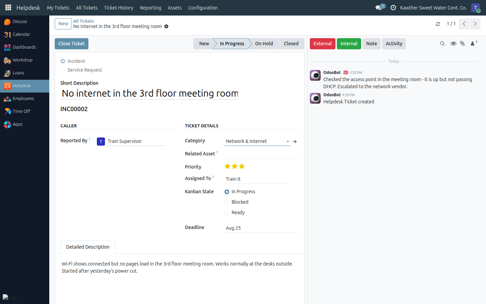
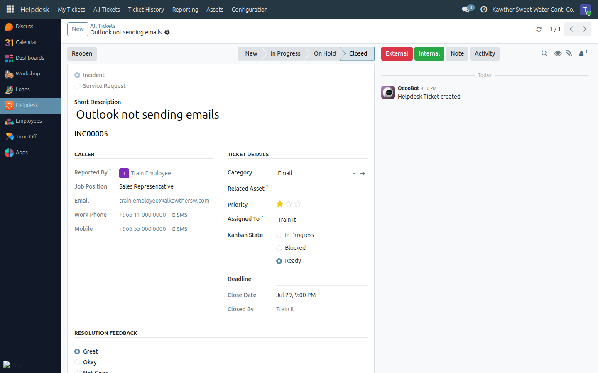

# Resolving and Closing a Ticket

**Who is this for:** IT Team
**How long it takes:** 1 minute to close, once the work is done

## What this does

Takes a ticket from "assigned to me" to a clean, closed record: the
conversation kept on the ticket, the fix documented, the closing stamped with
the date and your name, and the employee invited to rate the result.

## Before you start

- The ticket should be **assigned to you** (or you are closing on behalf of the
  team). Use **Assign to Me** if it is still unassigned.
- Anything you did outside the system — a phone call, a visit to the desk, a
  part ordered — belongs in the ticket as a message. The ticket is the record.

## Steps

1. **Work the ticket in the message box at the bottom** (the chatter). Which
   button you use decides who hears about it:

   | Button | Who is notified | Use it for |
   |---|---|---|
   | **External** | Everyone following the ticket — whoever raised it, and the assigned agent | Questions to the employee, progress updates, "please try this and tell me" |
   | **Internal** | The internal followers only | Handing over to a colleague, asking a teammate to look |
   | **Note** | Nobody | Diagnostics, part numbers, serials, what you tried — the written record |
   | **Activity** | The person you assign it to | Scheduling a follow-up: "call back Sunday", "chase the vendor" |

   Attach screenshots, photos or logs to any of them.

   > **Who is actually following?** The person who created the ticket and the
   > assigned agent. If a supervisor raised the ticket for someone else, the
   > employee themself is **not** a follower — add them with the followers
   > (person) icon at the top-right of the chatter before you expect them to
   > see your messages.

2. **Park it honestly if you are waiting.** Move it to **On Hold** and set the
   marker to **Blocked**, with a message saying what you are waiting for. A
   ticket that sits in In Progress for a week with no note is the thing this
   system exists to prevent.

3. **Fix it, and write down what you did.** One message describing the actual
   resolution — the setting you changed, the part you replaced, the account you
   unlocked. This is what makes **Ticket History** worth searching next time.

4. **Update the asset if the fix involved one.** Replaced a laptop? Send the old
   one to maintenance or mark it lost, and assign the new one — see
   [Assigning and returning assets](04-assign-and-return-assets.md). The
   ticket's **Related Asset** link is what ties the two records together.

5. **Click Close Ticket** in the header.
   

   Closing does four things at once: moves the ticket to the **Closed** stage,
   stamps the **Closing Date**, records **Closed By** as you, and sets the
   marker to **Ready**.

## What happens next

- The ticket leaves the open board (the **Closed** column is folded) and appears
  in **Ticket History** and in **Reporting**.
- **Resolution Time** is computed automatically — the hours between creation and
  closing. It is the measure the reports run on, which is why closing at the
  right moment matters more than it looks.
- A **Resolution Feedback** box appears on the ticket for the employee:
  **Great**, **Okay**, **Not Good**. Ask for it when you hand the work over —
  it is the only satisfaction signal in the system.

## Reopening

If the problem comes back, open the closed ticket and click **Reopen**. It
returns to the **New** stage, the closing date and closer are cleared, and the
marker goes back to In Progress. The whole conversation is preserved.

Reopen rather than raising a duplicate when it is genuinely the same problem —
the history stays in one place. Raise a new ticket when it is a new problem
that merely looks similar.

## Common issues

| Symptom | Cause | Fix |
|---|---|---|
| **Close Ticket** isn't in the header | The ticket is already closed | The **Reopen** button is there instead |
| **Assign to Me** isn't there | Someone is already assigned, or the ticket is closed | Change **Assigned To** directly |
| The employee says they weren't told | You used **Note** (notifies nobody) instead of **External** — or they are not a follower | Post with **External**, and add them as a follower if the ticket was raised on their behalf |
| Closed the wrong ticket | — | **Reopen** it; nothing is lost |
| Resolution Time looks wrong | It measures creation → closing, wall-clock, not working hours | Close tickets when the work actually ends, not in a weekly clean-up sweep |
| No feedback ever arrives | Employees don't know to rate it | Mention it when you hand over the fix |

## Related guides

- [Working the ticket queue](01-ticket-queue.md)
- [Reporting and ticket history](06-reporting-and-history.md)
- [Assigning and returning assets](04-assign-and-return-assets.md)
