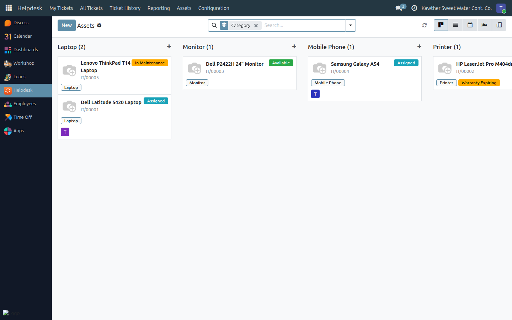
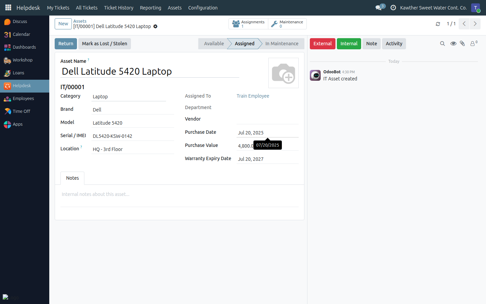

# The IT Asset Register

**Who is this for:** IT Team (nobody else can see this menu)
**How long it takes:** 2 minutes to register an asset

## What this does

Keeps one authoritative list of every piece of IT equipment the company owns —
laptops, desktops, monitors, phones, printers, networking gear, software
licenses, accessories — with what it is, what it cost, whether it is still
under warranty, and **who is holding it right now**.

It also feeds the helpdesk: the **Related Asset** field on a ticket offers an
employee only the equipment currently registered to them, so a ticket about
"my laptop" points at a specific serial number.

## Before you start

- **Assets are IT Team only.** No other role — manager or not — has the menu,
  the list or the reports. The single exception: an employee can read the
  asset(s) currently in their own custody, purely so the ticket field works.
- Have the device in hand: brand, model, serial number (or IMEI), where it came
  from and when, and the warranty end date if there is one.

## The register

Open **Helpdesk → Assets → Assets**. It opens as a kanban grouped by category,
each card showing the photo, name, asset tag, category and current status.

An asset is always in exactly one status:

| Status | Meaning |
|---|---|
| **Available** | In the store, ready to hand out |
| **Assigned** | In an employee's custody |
| **In Maintenance** | Out for repair |
| **Retired** | End of life. Archived — hidden unless you filter for it |
| **Lost / Stolen** | Unaccounted for |

## Steps — registering a new asset

1. **Open Helpdesk → Assets → Assets** and click **New**.

2. **Name it as a person would say it** — *"Dell Latitude 5420 Laptop"*, not
   *"asset 14"*.
   

3. **Pick the Category** (Laptop, Desktop, Monitor, Mobile Phone, Printer,
   Networking Equipment, Software License, Accessory). Required — it drives the
   grouping, the colour and every report.

4. **Fill in the identity:** Brand, Model, and the **Serial / IMEI**. The serial
   is what you will search by when someone reads a sticker over the phone, so
   type it carefully.

5. **Set the Location** — where it physically lives when nobody holds it, e.g.
   *"HQ – 3rd Floor Store"*.

6. **Record the purchase:** Vendor, Purchase Date, Purchase Value, and the
   **Warranty Expiry Date**. The warranty date is worth the ten seconds — see
   [Maintenance, loss and warranty](05-maintenance-and-warranty.md).

7. **Add a photo** (top-right image box) if it helps identify the unit, and any
   internal remarks on the **Notes** tab.

8. **Save.** The asset gets its permanent tag — `IT/00001`, `IT/00002`, … — and
   starts as **Available**.

## Finding an asset

The search box matches the **name, the asset tag and the serial number** at
once. Beyond that:

- Filters for **Available**, **Assigned**, **In Maintenance**, **Lost /
  Stolen**, **Retired**, **Archived**
- **Warranty Expiring Soon** and **Warranty Expired**
- Group by **Category**, **Status**, **Assigned To** or **Department**
- **Calendar** view plots warranty expiry dates by month; **Graph** and **Pivot**
  break the fleet down by category and status

The two buttons at the top of an asset form — **Assignments** and
**Maintenance** — open its full history: everyone who has held it, and every
repair it has been through.

## Common issues

| Symptom | Cause | Fix |
|---|---|---|
| "This asset tag already exists" | Tags are unique and generated automatically | Don't type tags by hand; let the sequence assign one |
| An asset vanished from the list | It was retired, which archives it | Add the **Archived** or **Retired** filter |
| **Assigned To** won't let me type in it | It is set by the assign/return workflow, never by hand | Use **Assign to Employee** — see [Assigning and returning assets](04-assign-and-return-assets.md) |
| An employee can't pick their device on a ticket | The asset isn't assigned to them in the register | Assign it properly; the ticket field follows custody |
| A colleague says the Assets menu isn't there | They are not in the **IT Team** group | That is by design — assets are IT-only |

## Related guides

- [Assigning and returning assets](04-assign-and-return-assets.md)
- [Maintenance, loss and warranty](05-maintenance-and-warranty.md)
- [Configuring stages and categories](07-configuration.md)
