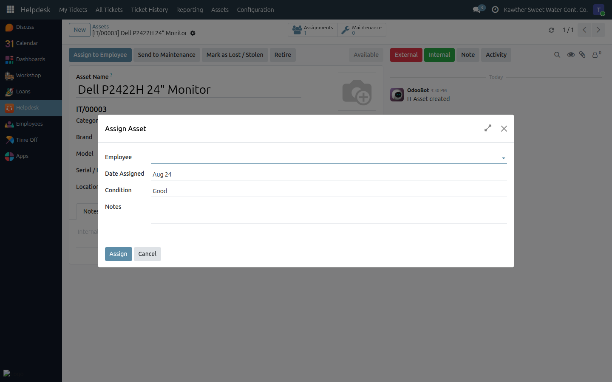
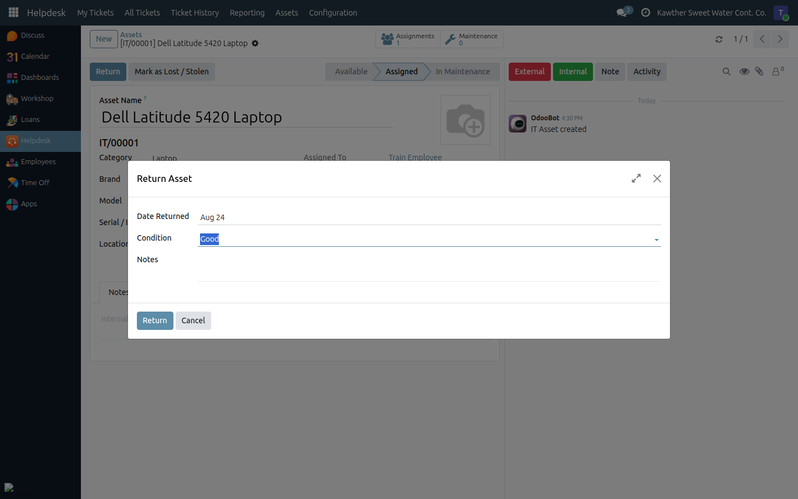
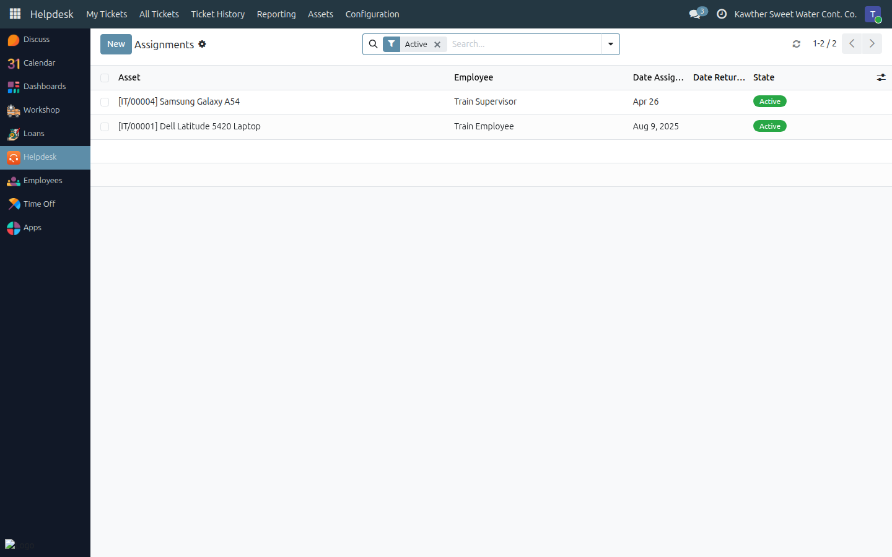

# Assigning and Returning Assets

**Who is this for:** IT Team
**How long it takes:** 1 minute each way

## What this does

Records custody: which employee is holding which device, from when, in what
condition — and closes that record when they hand it back. Every hand-over and
return is kept as a dated line, so any asset can answer "who had this, and
when?" years later, and any employee can be checked out on their last day.

## Before you start

- The asset must be **Available** to be assigned. If it is already with someone,
  return it first; if it is out for repair, bring it back from maintenance first.
- Agree the **condition** with the employee at hand-over — that is the number
  that protects both sides on the way back.

## Steps — assigning

1. **Open the asset** (**Helpdesk → Assets → Assets**) and click **Assign to
   Employee** in the header.
   

2. **Pick the Employee**, check the **Date** (defaults to today), and set the
   **Condition** you are handing it over in — New, Good, Fair or Poor.

3. **Add Notes** if anything is worth recording — accessories included, a
   scratch on the lid, a temporary loan with a return date agreed.

4. **Click Assign.** The asset switches to **Assigned**, **Assigned To** shows
   the employee, their department is filled in, and a new line opens in the
   assignment history.

From that moment the employee can select this device as the **Related Asset** on
their support tickets.

## Steps — returning

1. **Open the asset** and click **Return** in the header.
   

2. **Check the Date**, and record the **Condition it came back in**. This is the
   whole point of the return step: comparing condition out against condition in
   is how damage gets noticed at the right moment.

3. **Add Notes** — missing charger, cracked screen, wiped and reimaged.

4. **Click Return.** The open assignment line is closed with the return date and
   condition, the asset goes back to **Available**, and **Assigned To** is
   cleared.

## The custody history

**Helpdesk → Assets → Assignments** lists every hand-over ever recorded, across
all assets — searchable by employee, by asset, by category, and by **Active** or
**Returned**.

Two things it answers directly:

- **Off-boarding.** Filter by the employee and by **Active** — what is still in
  their custody, and therefore what must come back before their last day.
- **Device history.** From an asset's form, the **Assignments** button opens the
  same list for that one device: every holder, every date, condition out and in.

## Common issues

| Symptom | Cause | Fix |
|---|---|---|
| "Only an available asset can be assigned. Return or repair it first." | It is already assigned, in maintenance, retired or lost | Return it, or bring it back from maintenance, first |
| "This asset is not currently assigned." | You clicked **Return** on something nobody holds | Check the status bar |
| **Assign to Employee** isn't in the header | The asset isn't Available | Same as above |
| I assigned it to the wrong person | — | **Return** it (same day, same condition), then assign it correctly. Both lines stay in the history, which is honest and harmless |
| The employee left and the asset is still on them | Nobody ran the return | Return it now with the real date; the history keeps the true dates |
| An employee still can't pick their device on a ticket | Assignment not saved, or the ticket's employee is someone else | Confirm **Assigned To** on the asset matches **Reported By** on the ticket |

## Related guides

- [The IT asset register](03-asset-register.md)
- [Maintenance, loss and warranty](05-maintenance-and-warranty.md)
