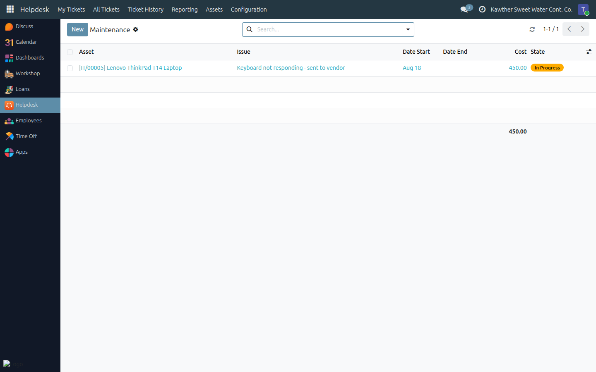

# Maintenance, Loss, Retirement and Warranty

**Who is this for:** IT Team
**How long it takes:** 1 minute per action

## What this does

Covers the rest of an asset's life after it has been bought and handed out:
sending it for repair and bringing it back, writing off what is lost or stolen,
retiring what has reached end of life, and staying ahead of warranty expiry so
repairs are claimed rather than paid for.

## Before you start

- All of these actions need the asset to be in the right status; the buttons
  appear and disappear accordingly. **An asset in an employee's custody must be
  returned first** — you cannot send it to maintenance while it is assigned.
- Know whether the device is still under warranty before you commit to a paid
  repair. The asset form tells you: a **Warranty Expiring** or **Warranty
  Expired** ribbon across the top, and a colour-coded status in the list.

## Sending an asset for repair

1. **Return it from the employee first** if someone holds it — see
   [Assigning and returning assets](04-assign-and-return-assets.md).

2. **Click Send to Maintenance** in the header. The asset switches to **In
   Maintenance** and a maintenance record is opened for it.

3. **Fill in the maintenance record** — **Helpdesk → Assets → Maintenance**, or
   the **Maintenance** button on the asset itself. Describe the **Issue**, set
   **Repaired By** (the vendor), and enter the **Cost** when you know it.
   

4. **When it comes back**, open the asset and click **Return from
   Maintenance**. The open maintenance record is marked **Done** with today's
   date, and the asset becomes **Available** again — ready to hand out.

The **Maintenance** button on any asset shows every repair it has ever had, with
costs. Two or three expensive repairs on one machine is the argument for
replacing it.

## Lost or stolen

Click **Mark as Lost / Stolen** (you will be asked to confirm). Use it when a
device genuinely cannot be accounted for — the status is visible in red across
the register and in every report.

> If the device was in someone's custody when it went missing, **return it from
> them first**, noting the circumstances in the return notes, then mark it lost.
> That way the custody record closes properly and the history reads correctly.

If it turns up, click **Retire** and then **Reactivate**, or simply reactivate
it from the archived list — it returns as **Available**.

## Retiring an asset

**Retire** is for end of life: written off, disposed of, sold, replaced. The
asset must be **Available** or **Lost / Stolen** first, so nothing gets retired
out from under an employee.

Retiring **archives** the asset: it keeps its full history but disappears from
the normal list. Find it again with the **Archived** or **Retired** filter; the
**Reactivate** button brings it back as Available if you retire one by mistake.

Prefer retiring to deleting. A deleted asset takes its custody and repair
history with it.

## Warranty tracking

Fill in **Warranty Expiry Date** when you register an asset, and the system
watches it for you:

| Warranty status | When |
|---|---|
| **Valid** | More than 30 days left |
| **Expiring Soon** | 30 days or fewer — amber badge, amber ribbon on the form |
| **Expired** | The date has passed — red badge, red ribbon |
| **No Warranty** | No date recorded |

- **Filters:** *Warranty Expiring Soon* and *Warranty Expired* on the asset
  list.
- **Calendar view:** every warranty expiry plotted by month — the quickest way
  to see what is about to run out.
- **Automatic reminder:** exactly **30 days before** an asset's warranty
  expires, the system schedules a to-do activity for **every member of the IT
  Team**. It shows up in your **Activities** (the clock icon in the top bar) and
  names the asset and the date.

That reminder is the point of filling the date in: it is the moment to raise
any pending repair with the vendor while it is still free.

## Common issues

| Symptom | Cause | Fix |
|---|---|---|
| "Only an available asset can be sent to maintenance." | It is assigned, retired or already in maintenance | Return it from the employee first |
| "This asset is not in maintenance." | You clicked **Return from Maintenance** on something that isn't out for repair | Check the status bar |
| "Return or repair this asset before retiring it." | Retire only works from **Available** or **Lost / Stolen** | Return it, or bring it back from maintenance, first |
| A retired asset disappeared | Retiring archives it | Filter by **Archived** / **Retired**, then **Reactivate** |
| No warranty reminders arrive | No expiry date on the asset, or the person isn't in the IT Team group | Fill in **Warranty Expiry Date**; the reminder goes to IT Team members only |
| The reminder came too late to be useful | It fires 30 days ahead, once | Also use the **Warranty Expiring Soon** filter as part of your monthly routine |

## Related guides

- [The IT asset register](03-asset-register.md)
- [Assigning and returning assets](04-assign-and-return-assets.md)
