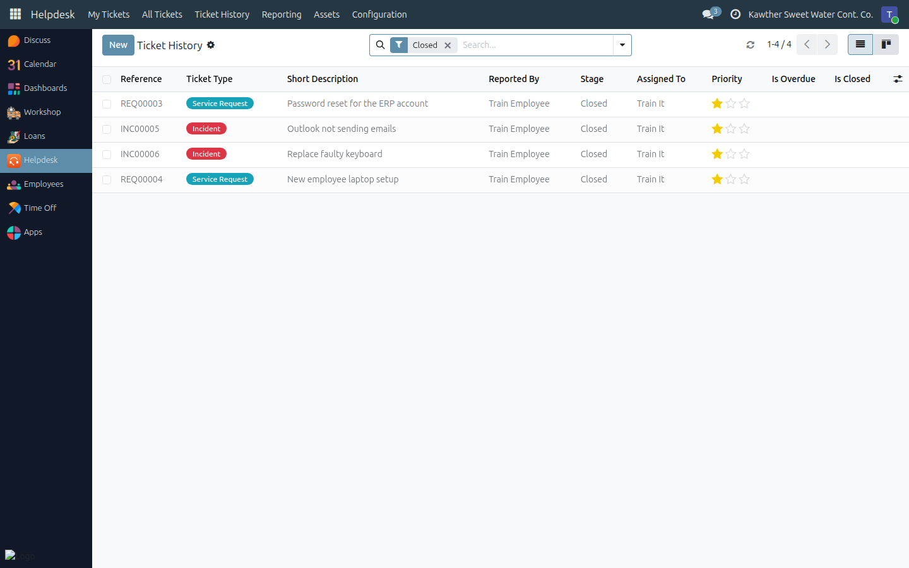
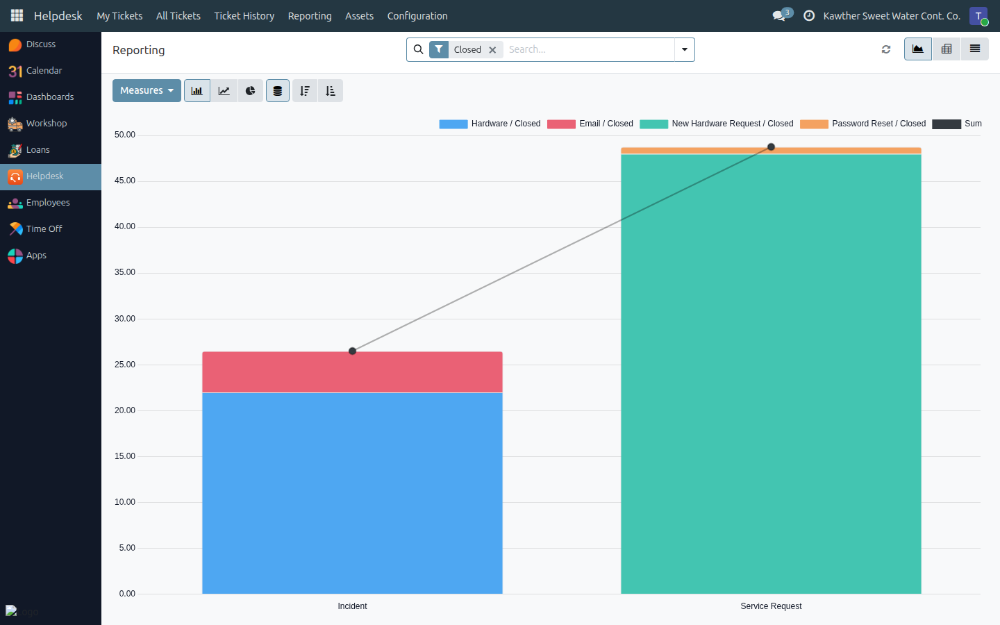

# Reporting and Ticket History

**Who is this for:** IT Team
**How long it takes:** 5 minutes

## What this does

Turns the closed tickets into two things you can act on: a **searchable record**
of what was solved and how (History), and **numbers** on volume, mix and speed
(Reporting).

Both look only at **closed** tickets — the work that is actually finished.

## Ticket History — "have we seen this before?"

**Helpdesk → Ticket History** is every closed ticket as a list.

The search box matches the **ticket number, title and description** together, so
searching `VPN` finds every VPN problem ever closed, including the message
threads that solved them. Before you start diagnosing something unfamiliar,
search the history first — the answer is often three months old.

Useful columns are hidden by default; add them from the **⚙ / optional columns**
toggle at the right of the header row: **Category**, **Deadline**, **Created
on**, **Closing Date**, **Closed By**, **Resolution (h)** and **Satisfaction**.

## Reporting — the numbers

**Helpdesk → Reporting** opens the same closed tickets as a chart, with the
**Pivot** and **List** views one click away.

Two measures are available: the **count** of tickets and **Resolution Time
(h)** — the hours between a ticket's creation and its closing.

Questions it answers directly:

| Question | How |
|---|---|
| What do we actually spend our time on? | Group rows by **Category**, measure **Count** |
| Incidents vs service requests | Group by **Type** |
| Who closes what | Group by **Assigned To** |
| Where are we slow? | Group by **Category**, measure **Resolution Time (h)**, switch to average |
| Is it getting better? | Pivot with **Closing Date : Month** as columns |
| Which department raises the most? | Group by the caller's department |

In the **Pivot** view, use the **Measures** menu to switch between Count and
Resolution Time (and to switch Resolution Time to an average rather than a
sum — a sum of hours across 200 tickets means nothing; the average is the
service level). **Download to Excel** from the pivot's toolbar when you need it
in a report.

> **Read resolution time honestly.** It is wall-clock time, including nights and
> weekends, measured from creation to closing. A ticket raised on a Thursday
> evening and closed Sunday morning reads as ~40 hours of "slow service". Use it
> to compare categories and months against each other, not as a contractual SLA.

## The open picture

Reporting covers finished work. For the live one, use the queue itself:

- **All Tickets → Overdue** — everything past its deadline
- **All Tickets → Unassigned** — nothing should sit here long
- **All Tickets** grouped by **Assigned To** — current workload per person
- The **Calendar** view — deadlines across the month

## Common issues

| Symptom | Cause | Fix |
|---|---|---|
| A ticket I closed isn't in the reports | It was reopened, so it is open again | Close it when it is genuinely done |
| Resolution times look far too high | Wall-clock, including weekends — and tickets closed in a late clean-up sweep | Close tickets when the work ends; compare relative, not absolute |
| The chart is empty | No closed tickets in the period you filtered | Widen the period |
| Satisfaction is blank almost everywhere | Employees rate only if asked | Ask for the rating when you hand over the fix |
| I need this in Excel | — | Use the **Pivot** view's download button |

## Related guides

- [Working the ticket queue](01-ticket-queue.md)
- [Resolving and closing a ticket](02-resolve-and-close.md)
