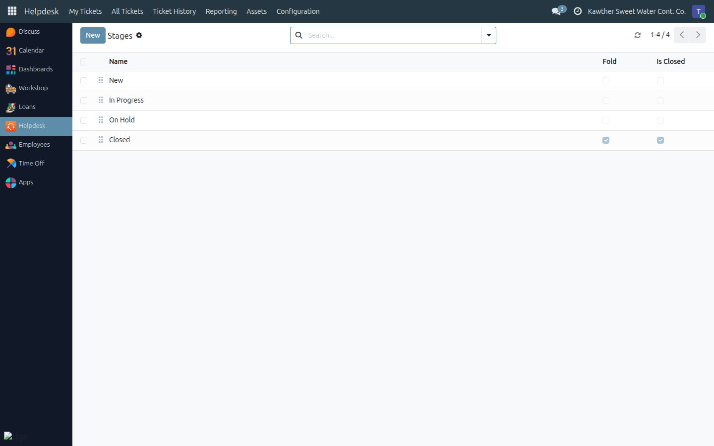
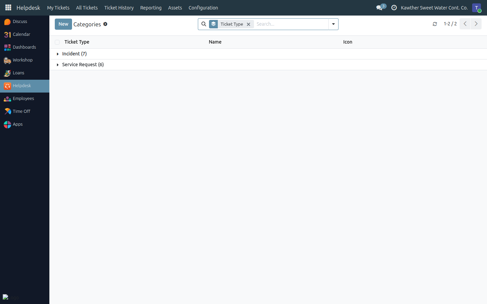
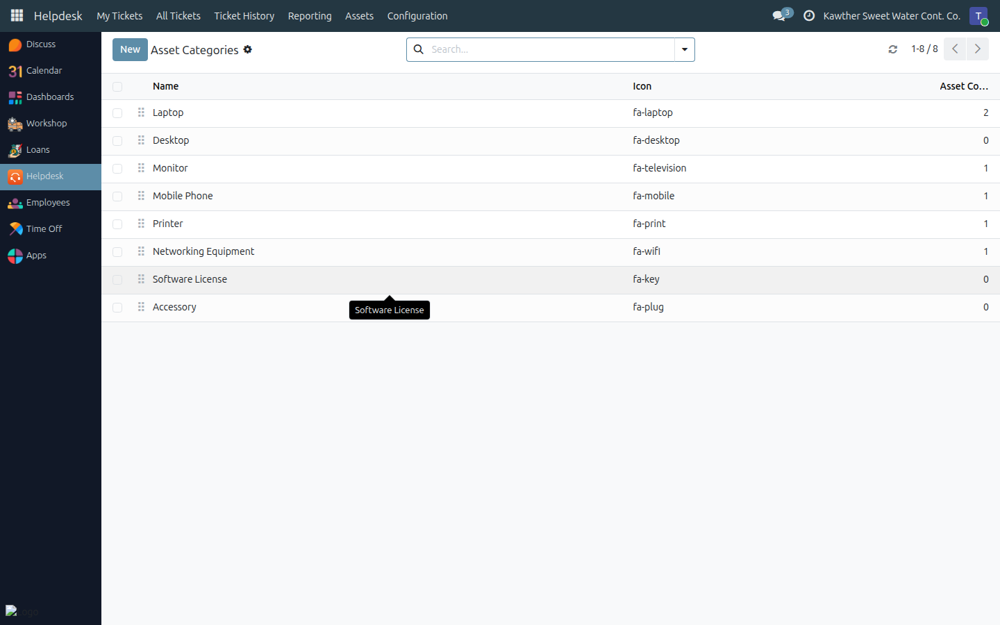

# Configuring Stages, Categories and Asset Categories

**Who is this for:** IT Team
**How long it takes:** 5 minutes

## What this does

Three short configuration lists shape the whole app: the **stages** a ticket
moves through, the **categories** employees choose from when raising one, and
the **categories** the asset register is organised by. All three live under
**Helpdesk → Configuration** and are IT Team only.

The system ships with all three already filled in sensibly. Change them when
your process changes — not before.

## Ticket stages

**Helpdesk → Configuration → Ticket Stages** — the columns of the kanban board.

| Field | What it does |
|---|---|
| **Name** | The column header on the board |
| **Sequence** | Left-to-right order |
| **Fold** | Folds the column on the board when empty — set on **Closed** |
| **Is Closed** | **The important one.** Tickets here count as resolved |
| **Description** | Shown as a tooltip on the board — use it to say what the stage means |

**Is Closed** is what the rest of the app keys on: the **Close Ticket** button
sends the ticket to the **first stage with Is Closed ticked**, and **Reopen**
sends it back to the **first stage without it**. Reporting, Ticket History, the
Open/Closed filters and the overdue calculation all read the same flag.

Two rules worth respecting:

- **Keep exactly one closed stage** unless you have a real reason for more.
  With two, "closed" stops being one number.
- **A stage that is in use cannot be deleted** — the system blocks it to protect
  the tickets sitting in it. Rename it, or move the tickets out first.

## Ticket categories

**Helpdesk → Configuration → Ticket Categories** — what an employee picks on the
form.

Every category belongs to **one kind**, and that is what makes the form behave:
choosing **Incident** offers only incident categories, choosing **Service
Request** only service-request ones.

| Kind | Shipped categories |
|---|---|
| **Incident** | Hardware · Software · Network & Internet · Email · Printer · Access & Permissions · Other |
| **Service Request** | New Hardware Request · New Software Installation · Access / Permission Request · Password Reset · Information / How-To · Other |

- The same **name may exist once per kind** — which is why "Other" appears in
  both lists — but not twice within one kind.
- **Colour** tints the ticket cards on the board; **Sequence** orders the
  dropdown, so put the common ones first.
- To stop offering a category without losing the tickets filed under it,
  **archive** it rather than deleting it.

Categories are the axis every report is grouped by. Adding one splits your
history; keep the list short and meaningful.

## Asset categories

**Helpdesk → Configuration → Asset Categories** — how the register is organised.

Shipped with **Laptop, Desktop, Monitor, Mobile Phone, Printer, Networking
Equipment, Software License** and **Accessory**. Each has a name, a sequence, a
colour (which tints the asset cards) and an icon, and shows how many assets are
filed under it — click through to see them.

Names are unique per company. Archive rather than delete when a category falls
out of use.

## Who can do all this

There are only two roles in the whole app:

| Role | Can |
|---|---|
| **User** (every employee, automatically) | Raise tickets for themselves or a direct report, follow them, comment, rate the resolution. No assets, no configuration |
| **IT Team** | Everything: every ticket, stage/assignee/marker changes, the asset register, and these configuration lists |

Roles are granted in **Settings → Users & Companies → Users**, under the
**Helpdesk** section of the user's form. Every internal user is a Helpdesk
**User** already — you never need to grant that; you only add people to **IT
Team**.

## Common issues

| Symptom | Cause | Fix |
|---|---|---|
| Closing a ticket sends it to the wrong stage | More than one stage has **Is Closed** ticked | Keep one; **Close** picks the first by sequence |
| **Reopen** lands the ticket in an odd stage | It goes to the first stage **without** Is Closed | Check the sequence of your open stages |
| A stage won't delete | Tickets still reference it | Move them out, or archive/rename the stage instead |
| "A category with this name already exists for this ticket type." | Names are unique per kind | Rename, or check whether it already exists under the other kind |
| An employee can't see the category I added | It belongs to the other kind | Categories follow the Incident / Service Request choice |
| A new IT colleague sees only their own tickets | They aren't in the **IT Team** group yet | Add them in **Settings → Users** |

## Related guides

- [Working the ticket queue](01-ticket-queue.md)
- [The IT asset register](03-asset-register.md)
