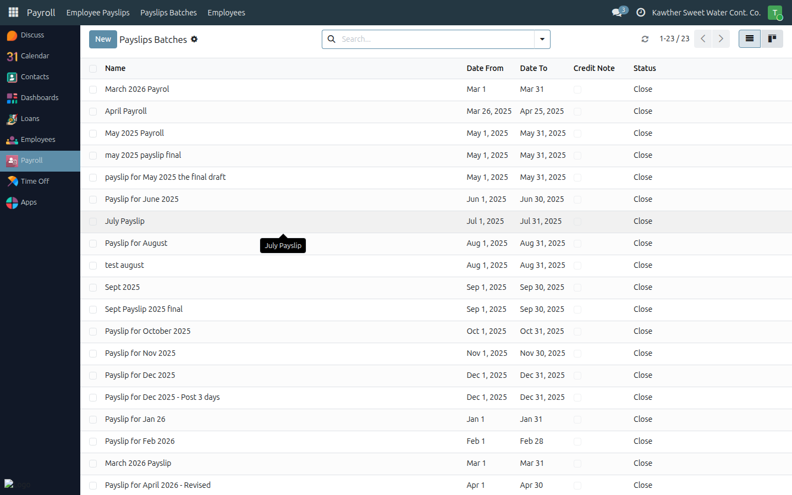
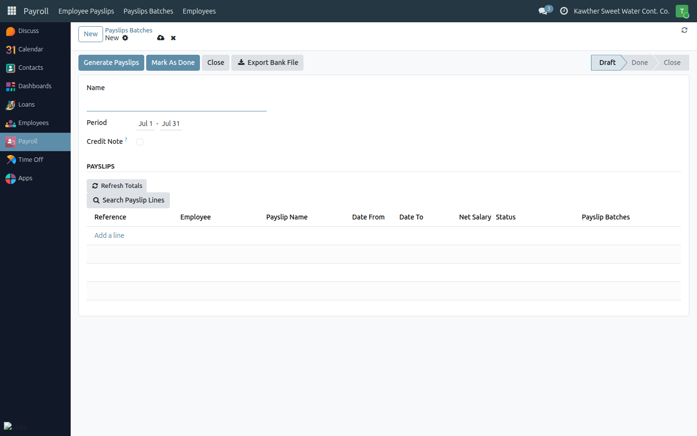

# Generating a Payslip Batch

**Who is this for:** Payroll initiator
**How long it takes:** 5–10 minutes per month

## What this does

Lets you run the monthly payroll: create a batch for the period, generate a
payslip for each employee, and review the results before export.

## Before you start

- Make sure attendance and any commission/loan updates for the period are done.
- Employees with an **unconfirmed annual-leave return** will be skipped — chase
  those confirmations first if you can.

## Steps

1. **Open Payroll → Payslip Batches** and create a new batch for the **period**.
   

2. Set the employees/period as needed, then click **Generate**.
   

3. The system creates a payslip per employee. Each payslip computes Basic →
   Gross → deductions (attendance, loans/penalties) → **Net Salary**.

4. **Review** the batch: open a few payslips to sanity-check the NET, and check
   the **Skipped Employees** section for anyone left out (see the next guide).

## What happens next

Once the payslips look right, you can refresh the per-bank NET totals
(**Refresh Totals**) and export the bank file (see
[Bank file export](03-bank-file-export.md)).

## Common issues

| Symptom | Cause | Fix |
|---|---|---|
| Some employees have no payslip | They were skipped | See [Resolve skipped employees](02-skipped-employees.md) |
| A NET looks wrong | A deduction/attendance issue | Open the payslip; the lines explain it. Fix the source (loan/attendance) and regenerate |
| Generate seems stuck | Large batch | Give it a moment; it processes each employee |

## Related guides

- [Resolve skipped employees](02-skipped-employees.md)
- [Bank file export](03-bank-file-export.md)
