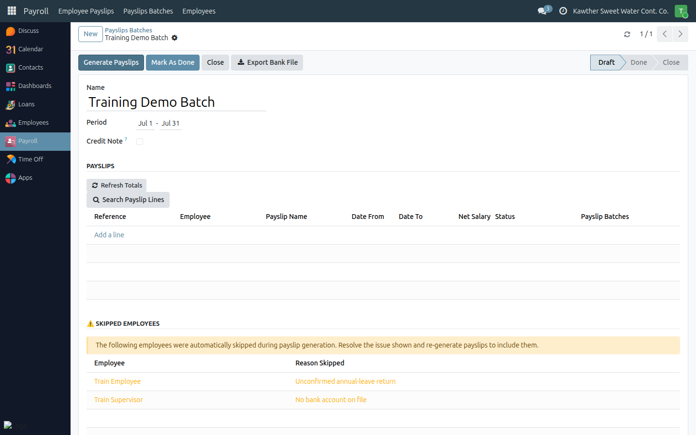

# Resolving Skipped Employees

**Who is this for:** Payroll initiator
**How long it takes:** varies

## What this does

When you generate payslips, the system **skips** any employee it can't process
and lists them with a reason. This guide explains how to clear those so everyone
gets paid.

## Before you start

- The most common reason is an **unconfirmed annual-leave return** — payroll is
  deliberately blocked until the employee confirms they're back.

## Steps

1. In the batch, open the **Skipped Employees** section. Each row shows the
   employee and the **reason** they were skipped.
   

2. **Fix the cause** of each skip:
   - *Unconfirmed leave return* → the employee (or HR) confirms the return date
     on the leave. See the employee guide
     [Confirm my return](../employee/02-request-time-off.md#confirming-your-return).
   - Other data issues → correct the underlying record (contract, bank, etc.).

3. **Re-generate** the payslips. Resolved employees now get a payslip. Use
   **Clear Skip Log** to tidy the list once handled.

## What happens next

Once no one is skipped (or the remaining skips are intentional), proceed to the
[Bank file export](03-bank-file-export.md).

## Common issues

| Symptom | Cause | Fix |
|---|---|---|
| Same employee keeps getting skipped | The cause isn't fixed yet | Resolve the exact reason shown, then regenerate |
| Skip list is cluttered | Old entries | Use **Clear Skip Log** |

## Related guides

- [Generate a payslip batch](01-generate-payslip-batch.md)
