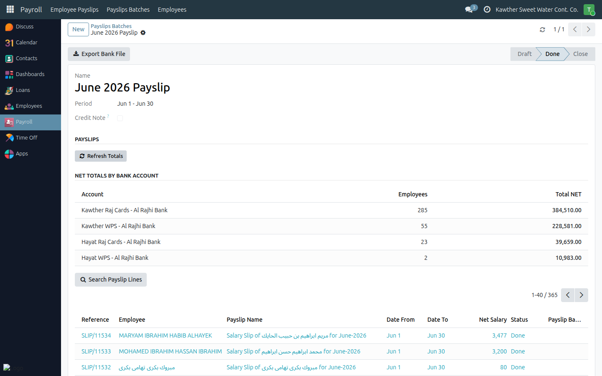
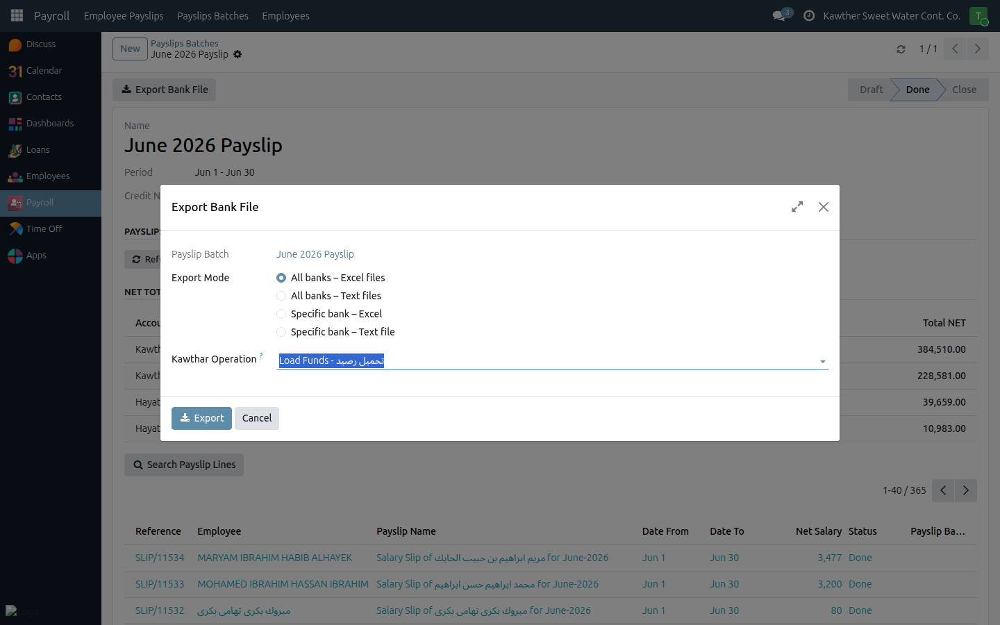

# Exporting the Bank File

**Who is this for:** Payroll initiator
**How long it takes:** 2 minutes

## What this does

Lets you export the salary transfer file for a completed payslip batch, ready to
upload to the bank. Totals are shown per bank so you can reconcile before paying.

## Before you start

- Generate and review the batch first, and resolve skipped employees.

## Steps

1. Open the payslip batch. Click **Refresh Totals** to recalculate the per-bank
   NET totals, then check the table (Bank Account, Employee Count, Total NET).
   

2. Click **Export Bank File**, choose the format (WPS / bank), and download.
   

3. Upload the file to the bank through your normal banking process.

## What happens next

The exported file is the record of what you paid. Keep it with the batch for
reconciliation.

## Common issues

| Symptom | Cause | Fix |
|---|---|---|
| Totals look outdated | Not refreshed after changes | Click **Refresh Totals** again |
| An employee missing from the file | They were skipped, or have no bank account | Resolve the skip; ensure the employee's bank account is set |

## Related guides

- [Generate a payslip batch](01-generate-payslip-batch.md)
- [Resolve skipped employees](02-skipped-employees.md)
