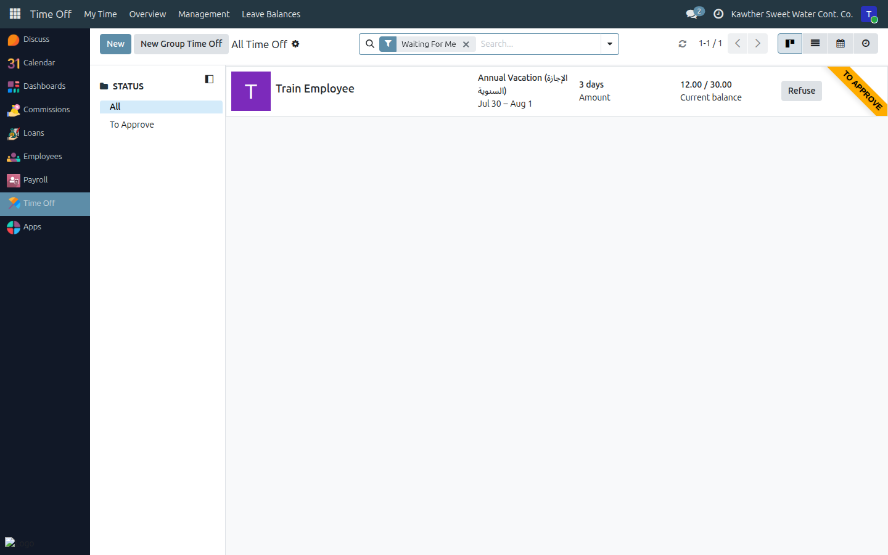
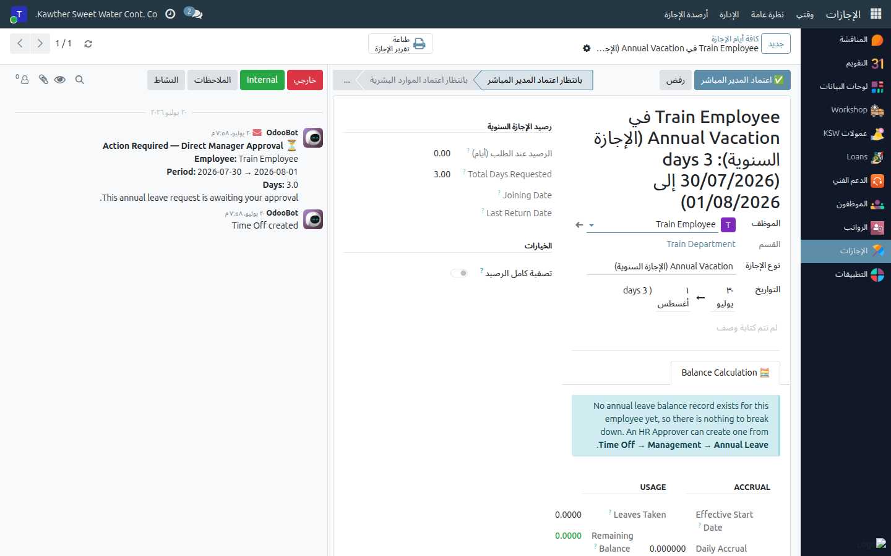

# Approving Time Off (Direct Manager)

**Who is this for:** Supervisor / Direct Manager
**How long it takes:** 1 minute per request

## What this does

Lets you approve or refuse a leave request from someone who reports to you. You
are the **first** step; after you approve, it continues to HR (and, for annual
leave, through the rest of the chain).

## Before you start

- You act only on **your direct reports'** requests.
- A refusal requires a short **reason** — the employee will see it.

## Where to find your team's requests

Open the **Time Off** app, then **Management → Time Off**. This list shows your
team's requests; find the employee whose request you want to review.

## Steps

1. **Open the employee's request** from the Management → Time Off list (or click
   the request link in your Inbox).

2. **Review** the leave type, dates, and number of days.

3. **Decide:**
   - **Approve** → click **Approve (DM)**. The request moves on to HR.
     
   - **Refuse** → click **Refuse**, enter the reason, and confirm.

4. **(Non-biometric staff only)** After you approve, a short window may appear
   asking how to reflect the leave on the attendance sheet — choose
   **Mark All Absent** to update those days automatically, or
   **I'll Update Manually** to do it yourself later.

## Requesting leave for someone without a system account

Some field staff don't have their own login. In that case **you** submit the
request for them and then approve the manager step yourself:

1. In **Management → Time Off**, click **New**.
2. Select the **employee**, the **leave type**, and the **dates**, then save.
3. Approve the **Direct Manager** step as above. The request then continues to
   HR like any other.

## Confirming an employee's return

When one of your team returns from **annual** leave, you record their return —
the employee does not do this themselves, and their next payslip is blocked
until you (or HR) do. See the dedicated guide:
[Confirming a Return from Annual Leave](08-confirm-return.md).

## What happens next

- **Approved** annual leave → moves to **Pending HR Approval**, then continues
  through GM → Accounting → GM → HR confirmation.
- **Approved** sick / unpaid / other leave → moves to **Pending HR Approval**
  (HR gives the final approval).
- **Refused** → the employee is notified with your reason and can revise and
  resubmit.

## Common issues

| Symptom | Cause | Fix |
|---|---|---|
| I can't see a request | The employee isn't your direct report | Confirm they report to you in **Management → Time Off** |
| No **Approve (DM)** button | Already approved, or not your team member | Read the status bar |
| Refuse won't confirm | Reason left empty | Enter a reason — it's required |
| The employee has no login | They're field staff without an account | Create the request for them (see above) and approve it |

## Related guides

- [Attendance sheets](03-attendance-sheets.md)
- [Approve a loan](02-approve-loan.md)
