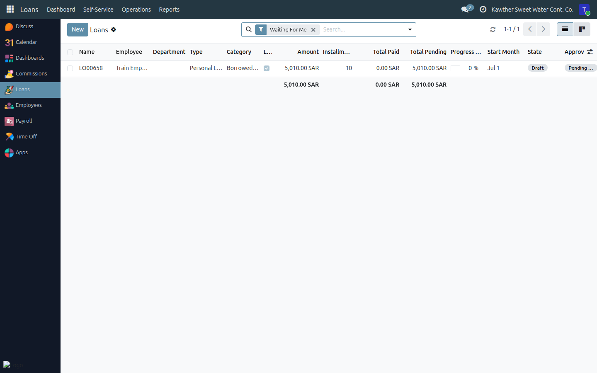
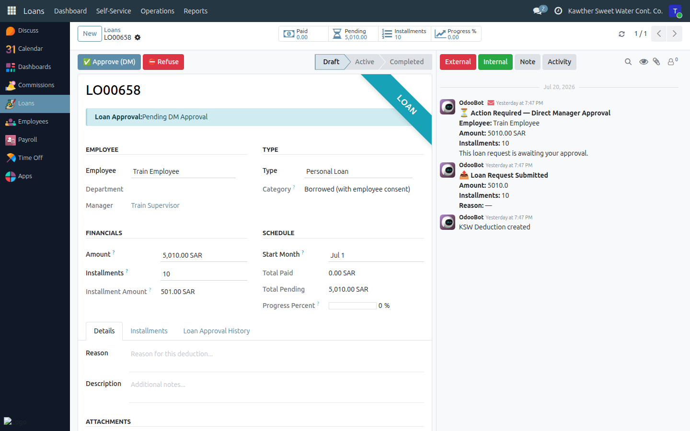

# Approving a Loan (Direct Manager)

**Who is this for:** Supervisor / Direct Manager
**How long it takes:** 1 minute per request

## What this does

Lets you approve or refuse a loan request from someone who reports to you. You
are the **first** approval step; after you approve it goes to HR, then
Accounting, then the GM, then disbursement.

## Before you start

- You act only on **your direct reports'** loan requests.
- A refusal requires a **reason**, which the employee sees.

## Steps

1. **Open the Loans app → Operations → Loans** (or click the request in your
   Inbox). The list opens on **Waiting For Me**, showing only loans at your step.
   

2. **Open the request** and review the amount, number of installments, the
   resulting monthly payment, and the employee's reason/attachments.

3. **Decide:**
   - **Approve** → click **Approve (DM)**. It moves to HR.
     
   - **Refuse** → click **Refuse**, enter the reason, confirm.

## What happens next

An approved loan moves to **Pending HR Approval** and continues:
**HR → Accounting → GM (final) → Disbursement → Active**. You'll see its state
update in **Loans → Operations → Loans**. A refused loan returns to the employee
with your reason.

## Common issues

| Symptom | Cause | Fix |
|---|---|---|
| I can't find the loan | Not your report, or not at your step | Use **Waiting For Me**; confirm they report to you |
| No approve button | Already past the DM step | Check the approval state banner |

## Related guides

- [Approve time off](01-approve-time-off.md)
