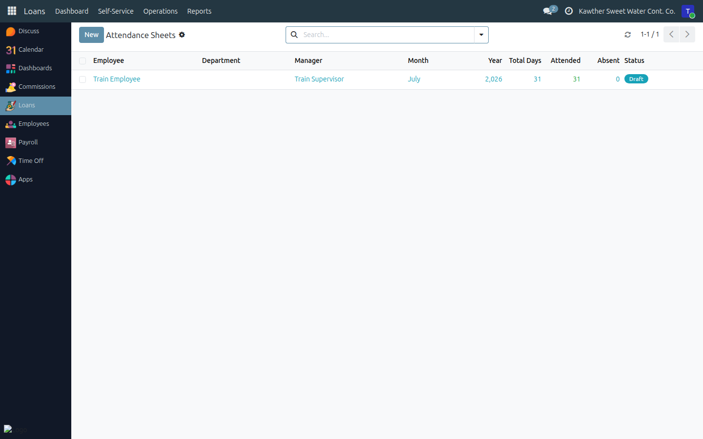
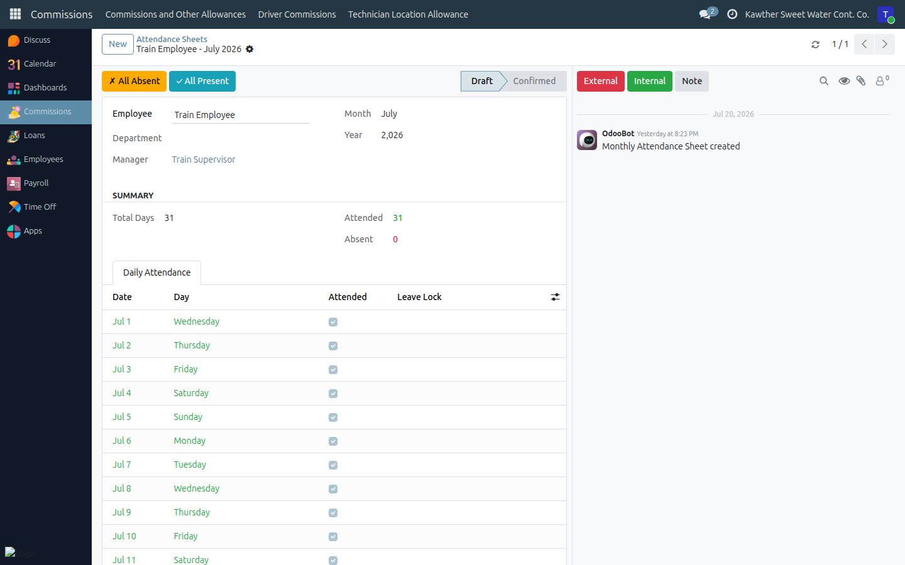

# Attendance Sheets (Non-Biometric Staff)

**Who is this for:** Supervisor / Direct Manager
**How long it takes:** 5 minutes per month

## What this does

Lets you record the monthly attendance of team members who are **not** on the
fingerprint/face device. You mark each workday present or absent; the sheet then
feeds payroll (uncovered absences cause deductions).

## Before you start

- This is only for **non-biometric** employees who report to you.
- You edit a sheet during its month; once the month closes it becomes read-only.
- Days already covered by an **approved leave** are **locked** — you can't (and
  shouldn't) change them.

## Steps

1. **Open Attendance → Attendance Sheets.**
   

2. **Generate the sheets** for the month if they don't exist yet — use
   **Generate All Sheets** on the list.

3. **Open an employee's sheet.** In the **Daily Attendance** tab you'll see one
   row per day.

4. **Mark attendance:**
   - Toggle each day between present (green) and absent (red), **or**
   - Use **All Present** / **All Absent** to set the whole month, then fix the
     exceptions.
   

5. Days with a linked **approved leave** are already filled and locked — leave
   them as they are.

## What happens next

The sheet stays editable through the current month, then is confirmed (locked)
when the month ends. Approved leaves automatically lock and fill the relevant
days. If a sheet needs reopening after it's locked, an **HR / attendance
manager** can Reset it to Draft (see the HR guide).

## Common issues

| Symptom | Cause | Fix |
|---|---|---|
| A day won't toggle | It's covered by an approved leave (locked) | That's expected — don't change it |
| No sheet for an employee | Not generated yet | Use **Generate All Sheets** |
| The sheet is read-only | The month has closed | Ask HR to Reset to Draft if a correction is genuinely needed |

## Related guides

- [Approve time off](01-approve-time-off.md)
- [Commission sheets](04-commission-sheets.md)
