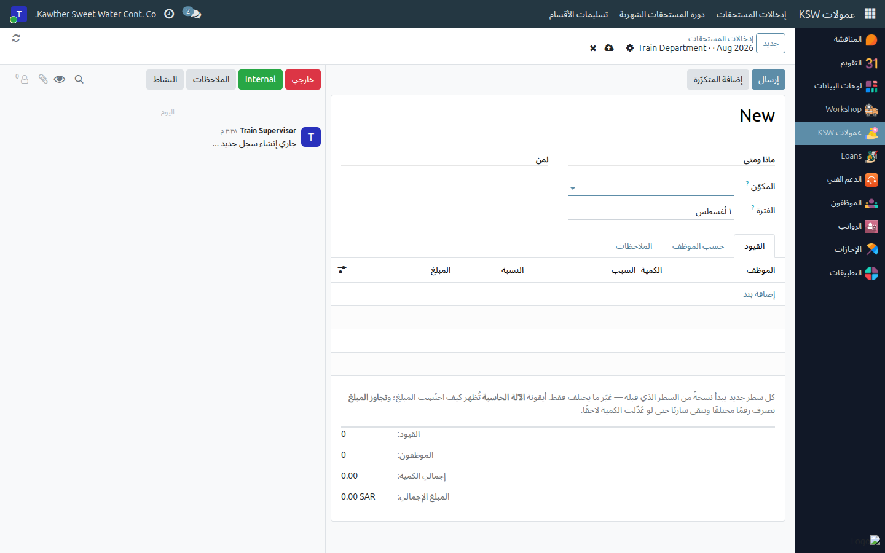
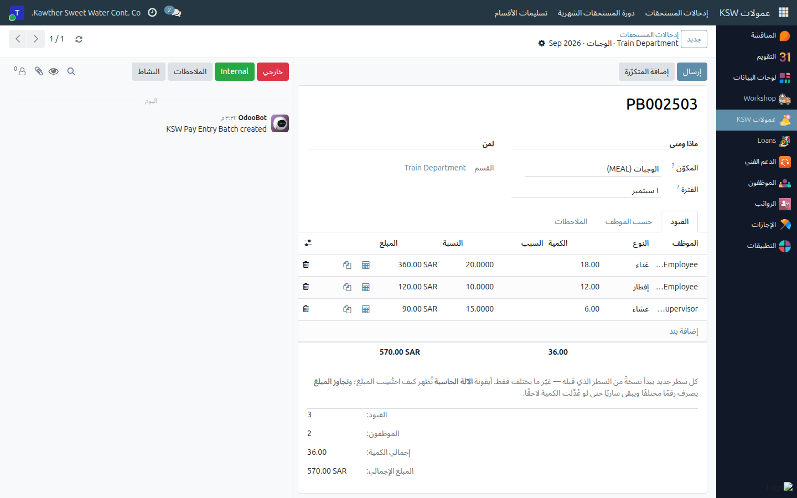

# Recording Extra Pay — Pay Entries

**Who is this for:** Supervisor / Direct Manager
**How long it takes:** 10–20 minutes per month, per kind of pay

## What this does

Everything your team earns **on top of the basic salary** — overtime, driver
trips, meals, allowances, Friday work, bonuses — is recorded in the
**Commissions** app as **pay entries**, then handed to the General Manager once a
month and paid on its own bank transfer.

This page covers the entry screen itself and how to deal with **each kind of pay**.
The two pages after it cover pay that repeats every month
([Recurring entries](05-commission-recurring.md)) and the month as a whole
([The monthly cycle](06-commission-monthly-cycle.md)).

> **Sales & Collection is not part of this.** Sales and collection commission is
> calculated on its own page (**Commissions → Sales & Collection**), is handled by
> the sales roles, and is paid separately. Nothing on these three pages applies to it.

## Before you start

- You must be set as the **manager of your department** (or as an assistant to its
  manager). If you are not, the app will tell you so and you will see nothing to
  record — ask HR to set it.
- You are ticked for the **kinds of pay you handle** (Overtime, Driver Commission,
  Location Allowance). If a component you expect is missing, ask the Commission
  Admin to tick it for you.
- Know the month you are recording for. A batch always covers **one whole month**.

## The three words you need

| Word | What it means |
|---|---|
| **Component** | A kind of pay — Overtime, Meals, Mobile Phone Allowance. The catalog. |
| **Entry** | One row: one employee, one occurrence, one amount. |
| **Batch** | One component, one department (or work site), one month. Your screen. |

**One batch per component per month.** Overtime for Maintenance in August is one
batch (`PB000123`); meals for the same department and month is a different one.
That is what lets each screen show only the columns that kind of pay needs.

## Steps

1. **Open Commissions → Pay Entries → My Batches.** The list is grouped by month.
   You only ever see batches for departments you run.
   

2. **Create the batch.** Click **New**, then choose:
   - **Component** — the kind of pay.
   - **Period** — the picker opens on a month grid; click the month.
   - **Department** — if you run only one, it is filled in and locked for you.
     Driver Trips asks for a **Work Site** instead, because it is paid per site.
   

3. **Add the rows** in the **Entries** tab. The columns change to fit the
   component — see the table below for what each kind asks for.
   

   Two things that save a lot of typing:
   - **Every new line starts as a copy of the line before it.** Just click
     *Add a line* and change what differs — the employee, the date, the hours.
   - The **copy** icon at the end of a row duplicates that row.

4. **Check the amounts.** Click the **calculator** icon on any row to see exactly
   how the figure was reached — the salary, the divisor, the overtime factor, or
   every tier band with its quantity and rate.
   

5. **Submit** the batch when you have finished typing it.

## How to deal with each kind of component

| Component | How the amount is worked out | What you type | What else the row asks for |
|---|---|---|---|
| **Overtime** | Basic salary ÷ 240 × hours × 1.5 (Saudi Labour Law art. 107) | **Hours** | **Date**, **Location** and **Reason** — all three are required on every row |
| **Driver Trips** | Tiered: the trips above the free allowance fall through the site's rate bands | **Weighted Trips** (الرد المضاعف) | **Actual Trips** (for justification only), **Free Allowance** = the driver's required trips for the days he actually worked. Recorded **per work site**, and there is an **Import** button that pulls the month's trips from BAS |
| **Meals** | Quantity × the rate of the meal you pick | **Meals** (the count) | **Type** — Breakfast, Lunch or Dinner. One Meals batch covers all three; do **not** look for three separate components |
| **Friday Work Allowance** | Days × 100 | **Days** | **Date** |
| **Fixed allowances** — Project Management, Location, Data Entry, Mobile Phone | Nothing is calculated | **Amount** | Location Allowance also asks **where** |
| **Holiday bonuses** — Foundation Day, National Day, Eid Al-Fitr, Eid Al-Adha | Nothing is calculated | **Amount** | — one component per holiday, on purpose |
| **Employee Bonus** and **Other** | Nothing is calculated | **Amount** | **Reason** is required — this is what the approver reads |

**Overriding an amount.** If a calculated figure has to be something else, type it
into **Override Amount**. The row turns amber, the original figure is kept, and the
explanation says it was overridden. Unlike simply retyping the amount, an override
survives a later change to the quantity.

## What happens next

The batch moves **Draft → Submitted**. That only means *"I have finished typing
this one"* — it is **not** yet with the General Manager, and you can still press
**Reopen** to correct it.

Your department only reaches the GM when you hand it over. See
[The monthly cycle](06-commission-monthly-cycle.md).

## Common issues

| Symptom | Cause | Fix |
|---|---|---|
| "You are not set as the manager of any department" | `Department Manager` is empty on your department | Ask HR to set you as the manager, or as an assistant to it |
| An employee is not in the picker | They are not in this batch's department/site and do not report to you | Record them in the right department's batch, or ask HR to fix the reporting line |
| "already covers this component for this scope and month" | You already have a batch for that component, scope and month | Open the existing one and add your rows there |
| "Hours must be greater than zero" | A row was left at 0 on a calculated component | Type the quantity, or delete the row |
| "…is outside the batch period" | A dated row carries a date from another month | Fix the date, or move the row to that month's batch |
| "Every Meals row has to say which one it is" | The **Type** column is empty | Pick Breakfast / Lunch / Dinner on the row |
| "Batch … has been submitted" when editing | The batch is no longer in Draft | Press **Reopen** — or, if your department is already handed over, **Take Back** the submission or ask the GM to return it |
| The component I need is not in the list | You are not ticked for that kind of pay, or it does not exist yet | Ask the Commission Admin |

## Related guides

- [Recurring entries](05-commission-recurring.md) — pay that repeats every month
- [The monthly cycle](06-commission-monthly-cycle.md) — submitting, approval and payment
- [Attendance sheets](03-attendance-sheets.md)
