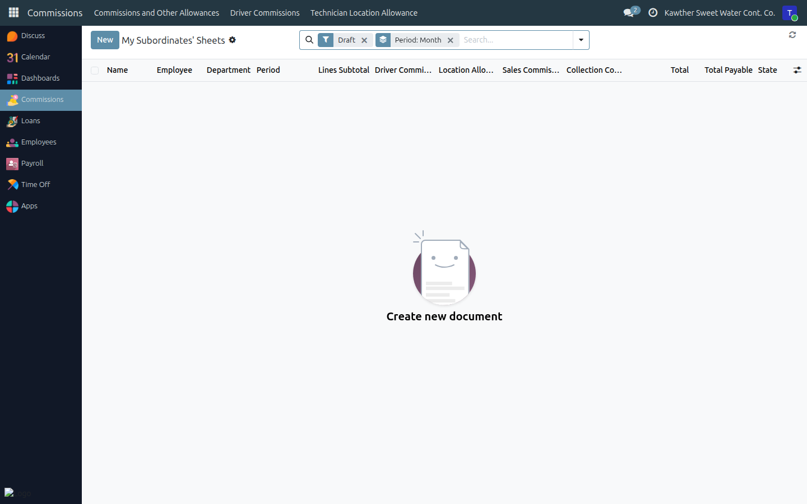
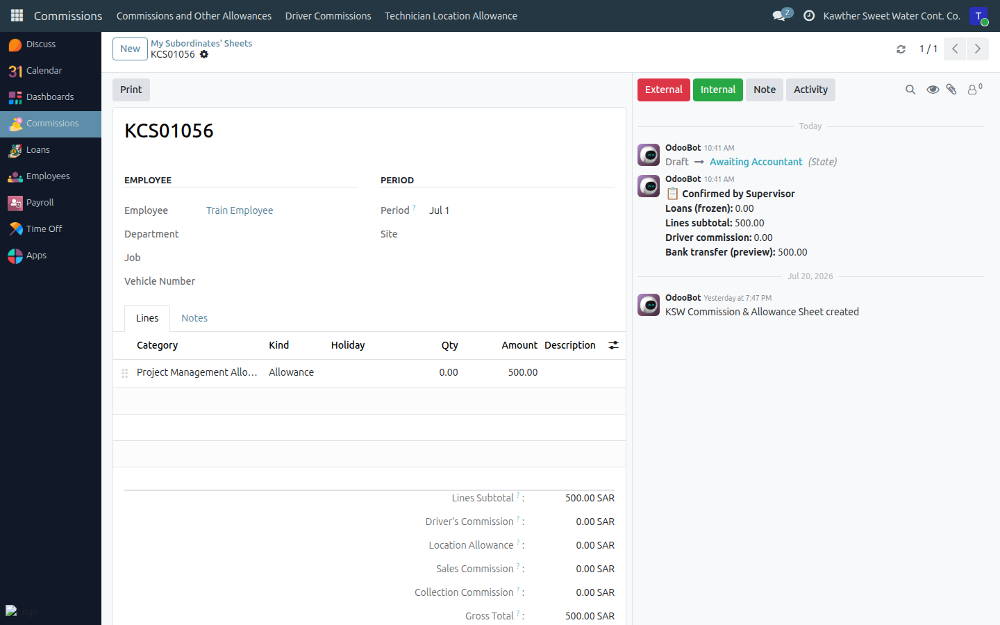

# Commission & Allowance Sheets

**Who is this for:** Supervisor / Direct Manager
**How long it takes:** 5 minutes per employee per month

## What this does

Lets you record the monthly **commissions and allowances** for your team
members who receive them, and confirm the sheet so Accounting can pay it.

## Before you start

- Applies to your direct reports who are set up for commissions.
- You fill and **Confirm** the sheet; Accounting then finalises it.

## Steps

1. **Open Commissions → My Subordinates' Sheets.**
   

2. **Open (or create) the sheet** for the employee and period.

3. **Add the lines** — each commission or allowance with its **category** and
   either a **quantity** (for quantity-based items) or an **amount**.
   - Shortcut: **Apply Template** pre-fills the lines from the employee's saved
     template, then you adjust.
   

4. **Check the totals** on the right. Note **Loans Deduction** shows the
   employee's current loan shortfall ("Live Shortfall") that will be recovered
   from this sheet — it freezes when you confirm.

5. **Confirm.** Click **Confirm** when the sheet is complete.
   

## What happens next

The sheet moves **Draft → Confirmed** and the loan-recovery amount is frozen.
It now waits for **Accounting** to finalise it (state → Done) and include it in
a payment batch. You can no longer edit the lines once confirmed — ask an
officer/accountant to reset it if you need to change something.

## Common issues

| Symptom | Cause | Fix |
|---|---|---|
| I can't edit after confirming | Sheet is Confirmed | Ask a commission officer/accountant to Reset to Draft |
| Employee has no sheet option | Not set up for commissions | Confirm eligibility with HR |
| A category is missing | Not in the catalog | Ask the Commission Admin to add it |

## Related guides

- [Attendance sheets](03-attendance-sheets.md)
