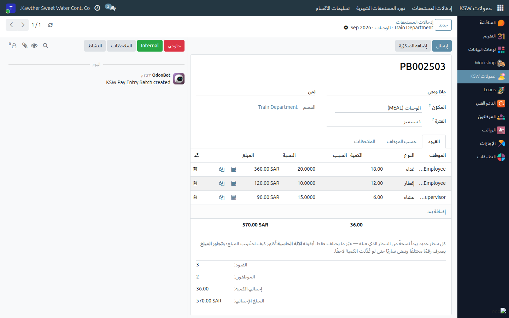

# Recurring Entries — Pay That Repeats Every Month

**Who is this for:** Supervisor / Direct Manager
**How long it takes:** 2 minutes to set one up; it then saves you that every month

## What this does

A **recurring entry** is a standing instruction: *"this employee gets this
component, at this amount, from this date until that one."* Instead of typing a
mobile-phone allowance for the same eleven people twelve times a year, you record
it once and pull it into each month's batch with one button.

> **A recurring entry is an instruction, not a payment.** Nothing is paid until you
> pull it into a batch and submit that batch. That is deliberate — you stay
> answerable for what you hand over, and you can still adjust the figure in a month
> where it changed.

## Before you start

- You maintain recurring entries **for your own team only** — the employee picker
  shows the people in the departments you run plus everyone in your reporting line.
- Have the figure and the **start date** ready. The start date is what decides which
  month it first appears in.

## When to create one — and when not to

**Create a recurring entry when all three are true:**

- it is the **same employee**, month after month;
- it is the **same component** at the **same figure**;
- it needs **no per-occurrence justification** — no date, no reason, no location.

Typical cases: a mobile-phone allowance, a project-management allowance, a
data-entry allowance, a standing meal entitlement.

**Do not create one for pay that varies.** Overtime, driver trips, Friday work and
one-off bonuses change every month and carry a date and a reason — they are typed
per occurrence in the batch itself. A recurring entry there would only give you a
wrong figure to correct twelve times a year.

**When to record it: before you build the month's batch.** The pull only picks up
entries whose **Start Date** is on or before the month you are recording, and whose
**End Date** is empty or on or after it. An allowance you add on the 20th, dated the
1st, is picked up for that month; one dated next month is not.

## Steps

1. **Open Commissions → Pay Entries → Recurring Entries.** The list is grouped by
   component.
   

2. **Add a line** and fill in:

   | Field | What to put |
   |---|---|
   | **Employee** | Your team member. |
   | **Component** | The kind of pay. |
   | **Type** | Only for a component that has choices (Meals) — which one repeats. |
   | **Quantity** | For a *quantity × rate* component — e.g. 22 lunches a month. |
   | **Amount** | For a *fixed* component — what to pay each month. |
   | **Reason** | Optional, but it is what a later approver reads. Say why. |
   | **Start Date** | Defaults to the 1st of this month. The first month it applies to. |
   | **End Date** | Leave empty to run indefinitely. |

   

3. **Save.** Nothing else happens — the instruction is now on file.

4. **Each month, pull it in.** Open (or create) that month's batch for the same
   component and click **Add Recurring**.
   

   The missing rows appear. It is safe to press it more than once: an employee who
   already has a row in the batch is skipped, so nothing is duplicated and nothing
   you typed by hand is overwritten.

5. **Adjust anything that changed** for this month, then submit the batch as usual.

## Ending or changing one

- **To stop it: set the End Date. Do not delete the entry.** The end date stops it
  cleanly from the next month, and the record of why the allowance was paid stays.
  Deleting throws that history away.
- **To change the figure permanently:** edit the amount or quantity. It applies to
  every month you pull from then on; months already submitted are untouched.
- **To change it for one month only:** leave the recurring entry alone and edit the
  row in that month's batch after pulling it in.
- **Created in error?** Untick **Active** (or delete it if it has never been pulled
  into a batch).

## What happens next

Nothing, until you pull it into a batch. The pulled rows behave like any other
entry from that point on: they are submitted with the batch, handed over with the
department, approved by the GM and paid on the commission transfer.

## Common issues

| Symptom | Cause | Fix |
|---|---|---|
| **Add Recurring** added nothing | The dates do not cover this month, the rows are already in the batch, or the employee is outside the batch's scope | Check **Start Date** / **End Date**, and check the batch's department or site |
| An employee is not in the picker | They are not in a department you run and do not report to you | Ask HR to correct the department or the reporting line |
| "…already has a recurring … starting on that date" | There is already an entry for that employee, component, type and start date | Edit the existing one instead of adding a second |
| "A recurring Meals has to say which one it is" | The component has choices and **Type** is empty | Pick Breakfast / Lunch / Dinner |
| "The end date cannot be before the start date" | Dates the wrong way round | Fix the dates |
| The pulled row shows the wrong amount | The component is calculated, not fixed — the amount comes from the quantity | Correct the **Quantity**, or override the amount on the batch row |

## Related guides

- [Recording extra pay](04-commission-pay-entries.md)
- [The monthly cycle](06-commission-monthly-cycle.md)
