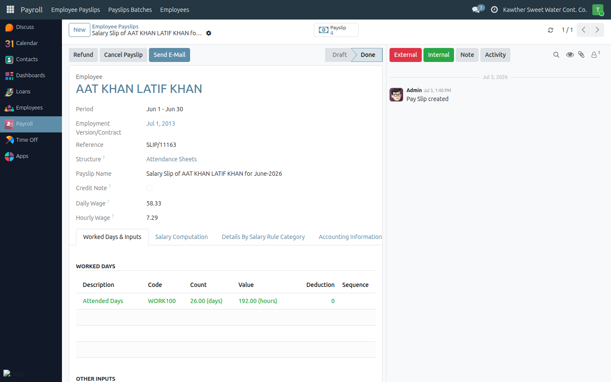

# Viewing My Team's Payslips

**Who is this for:** Supervisor / Direct Manager
**How long it takes:** 1 minute

## What this does

Lets you see the payslips of the people who report to you (read-only), so you
can answer questions or check that pay was processed.

## Before you start

- You can see **your own + your direct reports'** payslips. You cannot edit them.

## Steps

1. **Open Payroll** from the main menu.
2. **Open a payslip** for a team member and read the salary lines (Basic, Gross,
   deductions, Net Salary) — same layout as your own payslip.
   

## What happens next

Read-only. For corrections, contact HR/payroll — supervisors cannot change
payslips.

## Common issues

| Symptom | Cause | Fix |
|---|---|---|
| I can't see a team member's payslip | Not a direct report, or not generated | Confirm they report to you and payroll has run |

## Related guides

- [View my payslip](../employee/04-view-payslip.md)
