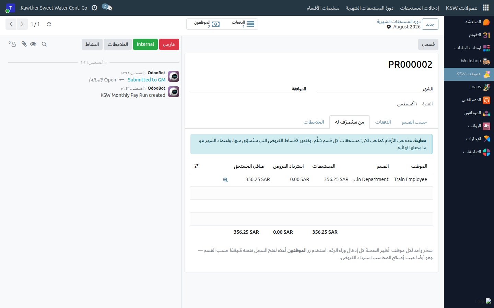

# The Monthly Cycle — Submitting and Getting Paid

**Who is this for:** Supervisor / Direct Manager
**How long it takes:** 10 minutes at the end of the month

## What this does

Explains what happens to your entries after you have typed them: how your
department is handed over, who approves it, how the payment is worked out, and what
locks when.

## The chain, once

```
your entries  →  Submit the batch      ("I have finished typing this one")
              →  Submit My Entries     (your DEPARTMENT goes to the GM)
              →  the GM approves your department
              →  the month locks and the Payment Register is built
              →  Accounting exports the bank file
```

## The two Submits are not the same thing

This is the single most common confusion in the app.

| | **Submit** on a batch | **Submit My Entries** / **Submit to GM** |
|---|---|---|
| What it means | I have finished typing this one batch | My whole department is complete — please approve |
| Who sees it | Nobody yet | The General Manager, in his inbox and by email |
| Can you undo it? | Yes — **Reopen**, on your own | Only **Take Back** (while the GM has not acted), or he **Returns** it |
| Effect on your batches | None — still yours | **Frozen.** You cannot edit them |

So a batch sitting in *Submitted* is **not** with the GM. Until you hand the
department over, your work is still on your desk.

## Steps

1. **Finish and submit every batch** for the month.

2. **Check the money before you hand over.** Open **Commissions → Monthly Pay Run**,
   pick the month, and open the **Who Gets Paid** tab. You see your own people:
   what they earned, what their loan installments will take, and the net.
   

   While the month is open these figures are a **preview** — an estimate of what
   would be settled. Approval turns them into the real settlement.

3. **Hand the department over.** On the same screen, click **Submit My Entries**.
   It submits any batch you left in Draft on the way through, and it moves **only
   your** departments — never anyone else's.
   

   The same button exists as **Submit to GM** on
   **Commissions → Department Submissions**, if you prefer to work from there.

4. **Wait for the General Manager.** He approves your department, or returns it.

## How the payment is worked out

- Extra pay is paid on **its own bank transfer**. It does not go through the
  payslip.
- For each employee: **Net payable = earnings − loan recovery.**
- The **loan recovery** is the installments parked against commission for that
  month. They are settled oldest-first out of the commission; if the commission only
  partly covers an installment, that installment is split and the rest keeps waiting.
- Employees flagged **Settle Deductions from Commission First** have that month's
  installments parked automatically when the month is approved. Anything the
  commission does not cover falls straight into that month's payslip instead of
  waiting for a future commission run.

## If it comes back

A returned department carries the GM's **reason**, shown in an amber banner on the
department submission **and on every batch in it**. Fix what he asked for, then press
**Submit My Entries** again.

## Once the month is locked

When the month is approved, the period is closed. Nothing in it can be created,
edited, deleted, submitted or reopened — every attempt gives you a message naming the
month and telling you to ask the General Manager. **Anything you missed goes into
next month's batch.**

## What happens next

The Payment Register is built from the approved departments only, the loan
installments are settled, and Accounting exports the bank file and marks the month
paid. A department that never handed over is simply not paid this month; its work
stays in Draft for you to submit next month.

## Common issues

| Symptom | Cause | Fix |
|---|---|---|
| No **Submit My Entries** button | You have nothing outstanding — either nothing recorded, or already submitted | Check **Department Submissions** for the month's status |
| "There is nothing to submit — no entries have been recorded" | Your batches are empty | Fill them in, or delete the empty ones |
| "These batches have no entries" | An empty batch is blocking the handover | Delete it or fill it in |
| I need to correct a submitted batch | Your department is already handed over | **Take Back** the submission if the GM has not acted, otherwise ask him to Return it |
| "has been approved and is locked" | The month is closed | Record it in next month's batch |
| The register shows figures I did not expect | It is a preview until approval, and it includes every handed-over department of yours | Open a line's entries to see exactly what made the figure |

## Related guides

- [Recording extra pay](04-commission-pay-entries.md)
- [Recurring entries](05-commission-recurring.md)
- [View team payslips](07-view-team-payslips.md)
