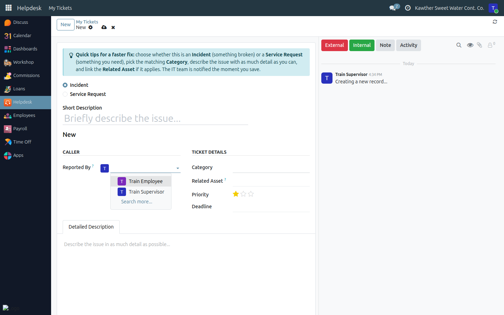
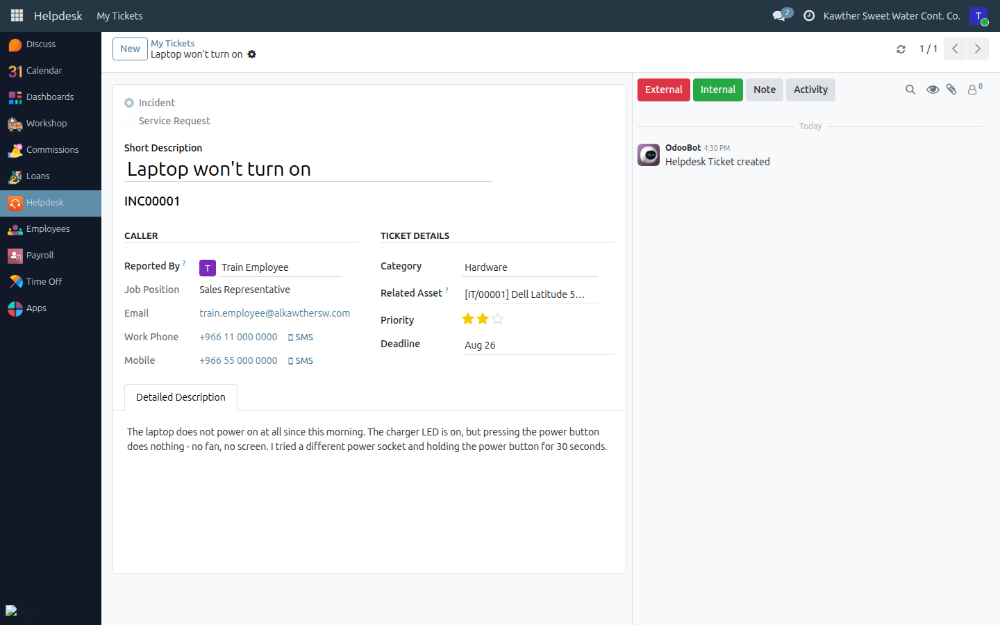

# Raising an IT Ticket for a Team Member

**Who is this for:** Supervisor / any manager with direct reports
**How long it takes:** 2 minutes

## What this does

Lets you raise an IT support ticket **on behalf of someone who reports to
you** — typically a field or workshop employee who has no login, or someone
who is away from a computer while their machine is down.

The ticket belongs to that employee: their name, department, job title and
contact details appear on it as the **Caller**, so IT knows who to call. You
stay on the ticket as its author and follow it to closure.

## Before you start

- The person must be your **direct report** (their **Manager** field on the
  employee record points at you). The system only offers you yourself and your
  direct reports — nobody else.
- Get the details from them first: what happens, since when, and which device.

## Steps

1. **Open the Helpdesk app → My Tickets** and click **New**.

2. **Change "Reported By"** from yourself to the team member.
   
   The **Caller** panel refills with their job title, department, email and
   phone numbers.

3. **Fill in the ticket as usual** — Incident or Service Request, a clear short
   description, the Category, the Related Asset if it is about their device,
   the Priority, and a detailed description.
   

4. **Save.** IT is notified.

## What happens next

- The ticket appears in **your** My Tickets list and in the employee's, and both
  of you can follow it and reply in the message box.
- IT contacts the **Caller** — the employee — using the details on the ticket,
  not you. Make sure their work phone/mobile on the employee record is current.
- Everything else works exactly as it does for your own tickets: see
  [Raising an IT support ticket](../employee/05-raise-support-ticket.md) for the
  full walk-through of the fields, the two kinds, and the closing feedback.

## Common issues

| Symptom | Cause | Fix |
|---|---|---|
| The employee isn't in the **Reported By** list | They are not your direct report in the system | Ask HR to set their **Manager** on the employee record |
| "You can only create or edit tickets for yourself or your direct reports" | Same cause — the reporting line isn't set | As above; meanwhile raise it under your own name and explain who it is for |
| The Caller panel is empty | The employee record has no job title/department/contact details | Ask HR to complete the employee record |
| I can't see a ticket my team member raised themselves | You see your direct reports' tickets — check you are their manager, not only their leave approver | Ask HR to confirm the **Manager** field |

## Related guides

- [Raising an IT support ticket](../employee/05-raise-support-ticket.md) — the full field-by-field guide
- [Approving time off](01-approve-time-off.md)
